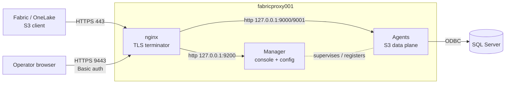

# SSL Deployment (Linux) — TLS termination at nginx

End-to-end guide to put **HTTPS in front of both surfaces** of the Fabric Shortcut
Proxy on Linux using **nginx as the TLS terminator** (the "Option 1" design):

- **S3 data plane** (agents, ports `9000`/`9001`) — what Fabric connects to.
- **Operator console + config API** (Manager, port `9200`) — `/_manager`, `/_config`, `/_monitor`.

nginx does the TLS; the proxy processes stay on plain HTTP bound to `127.0.0.1`.
No application code changes, certs rotate with a zero-downtime `nginx -s reload`,
and SigV4 is preserved because nginx passes the signed `Host` + `Authorization`
headers through unchanged.

> Assumes the systemd install from
> [docs/LINUX_MANAGER_TROUBLESHOOTING.md](docs/LINUX_MANAGER_TROUBLESHOOTING.md):
> repo at `/opt/fabric-shortcut-proxy`, env file `/etc/fabric-shortcut-proxy.env`,
> unit `fabric-shortcut-proxy.service`. Adjust paths/user to your install.

---

## 1. Architecture



Public listeners after this guide: **443** (Fabric data plane), **9443** (operator
console), **80** (redirect to 443). Everything else (`9000`, `9001`, `9200`) is
bound to `127.0.0.1` and never leaves the box.

---

## 2. Prerequisites

- Ubuntu/Debian host with the proxy already running under systemd.
- A **DNS name** that resolves to the host. Fabric will **not** trust a self-signed
  or bare-IP cert on the data plane, so the S3 endpoint needs a CA-issued cert for
  a hostname. On an Azure VM the quickest path is the free DNS label:
  `myproxy.<region>.cloudapp.azure.com` (Portal → VM → Configuration → DNS name).
- Ports **80** and **443** reachable from Fabric; **9443** reachable from your admin
  network only.
- `sudo` access.

```bash
sudo apt-get update
sudo apt-get install -y nginx
```

---

## 3. Bind the proxy to localhost (defense in depth)

Once nginx fronts everything, the app itself should not be publicly reachable. Set
the bind addresses in the env file so the agents and Manager listen only on
loopback.

```bash
# /etc/fabric-shortcut-proxy.env  (append or edit)
sudo tee -a /etc/fabric-shortcut-proxy.env >/dev/null <<'EOF'
HOST=127.0.0.1
CONTROL_HOST=127.0.0.1
FORWARDED_ALLOW_IPS=127.0.0.1
EOF
```

- `HOST=127.0.0.1` — agents (`main.py`) bind loopback on `9000`/`9001`.
- `CONTROL_HOST=127.0.0.1` — Manager binds loopback on `9200`; agents still register
  to `http://127.0.0.1:9200` automatically.
- `FORWARDED_ALLOW_IPS=127.0.0.1` — trust `X-Forwarded-For` **only** from nginx, so
  the audit log records the real Fabric client IP, not the proxy's.

Apply after the nginx steps below with one restart:

```bash
sudo systemctl restart fabric-shortcut-proxy.service
```

---

## 4. Enable the Manager password gate

The console rides over nginx TLS, so turn on the built-in HTTP Basic auth (Basic
sends credentials on every request — only safe over TLS).

```bash
# Choose a strong password; store it in the env file (never on a CLI you log).
sudo tee -a /etc/fabric-shortcut-proxy.env >/dev/null <<'EOF'
MANAGER_AUTH_ENABLED=1
MANAGER_AUTH_USERNAME=operator
EOF
# Add the password separately so it isn't echoed into shell history/logs:
read -rs PW; printf 'MANAGER_AUTH_PASSWORD=%s\n' "$PW" | sudo tee -a /etc/fabric-shortcut-proxy.env >/dev/null; unset PW
```

You can also set these from the `/_config` Advanced tab. Either way, restart to
apply (done in step 3's restart).

---

## 5. Certificates

You need **two** trust profiles:

| Surface | Cert requirement |
|---|---|
| Data plane (443, Fabric) | **CA-trusted** cert for the DNS name (Let's Encrypt or enterprise/public CA). Self-signed is rejected by Fabric. |
| Console (9443, browser) | Any cert works; a self-signed one just shows a one-time browser warning. |

### 5a. Let's Encrypt (recommended for the data plane)

Requires the DNS name from step 2 and port 80 reachable.

```bash
sudo apt-get install -y certbot python3-certbot-nginx
# HTTP-01 challenge; certbot writes the cert and wires auto-renewal.
sudo certbot certonly --nginx -d myproxy.<region>.cloudapp.azure.com \
  --non-interactive --agree-tos -m you@example.com
# Certs land at:
#   /etc/letsencrypt/live/<name>/fullchain.pem
#   /etc/letsencrypt/live/<name>/privkey.pem
```

### 5b. Enterprise / public CA (CSR)

```bash
sudo mkdir -p /etc/nginx/tls
openssl req -newkey rsa:2048 -nodes \
  -keyout /etc/nginx/tls/fsp.key -out /etc/nginx/tls/fsp.csr \
  -subj "/CN=myproxy.example.com" \
  -addext "subjectAltName=DNS:myproxy.example.com"
# Submit fsp.csr to your CA, then install the returned FULL CHAIN
# (leaf + intermediates concatenated) as /etc/nginx/tls/fsp.crt.
sudo chmod 600 /etc/nginx/tls/fsp.key
```

### 5c. Self-signed (console only, or lab/testing)

```bash
sudo mkdir -p /etc/nginx/tls
sudo openssl req -x509 -newkey rsa:2048 -nodes -days 365 \
  -keyout /etc/nginx/tls/fsp.key -out /etc/nginx/tls/fsp.crt \
  -subj "/CN=fabricproxy001" \
  -addext "subjectAltName=DNS:fabricproxy001,IP:20.91.210.146"
sudo chmod 600 /etc/nginx/tls/fsp.key
```

> **Fabric + self-signed:** the SaaS service won't trust it. Only use self-signed
> for the data plane if Fabric reaches you through an **on-premises data gateway**
> whose trust store you control; otherwise use 5a/5b for port 443.

---

## 6. nginx configuration

Two server blocks: the **data plane** (443, locked to S3) and the **console**
(9443, allows the control surface). Set `CERT`/`KEY` to whichever paths step 5
produced (Let's Encrypt paths shown; swap for `/etc/nginx/tls/fsp.*` if self-signed).

```bash
sudo tee /etc/nginx/conf.d/fsp-ssl.conf >/dev/null <<'EOF'
# ---- shared cert vars (edit these two paths) ----
# Let's Encrypt example:
#   ssl_certificate     /etc/letsencrypt/live/<name>/fullchain.pem;
#   ssl_certificate_key /etc/letsencrypt/live/<name>/privkey.pem;

# Single-box upstream: the two local agents. For a multi-host fleet, replace this
# block with the renderer include (see section 7).
upstream fsp_agents {
    server 127.0.0.1:9000 max_fails=2 fail_timeout=5s;
    server 127.0.0.1:9001 max_fails=2 fail_timeout=5s;
}

# ===== DATA PLANE (Fabric) : 443 =====
server {
    listen 443 ssl;
    http2 on;
    server_name _;

    ssl_certificate     /etc/letsencrypt/live/CHANGE_ME/fullchain.pem;
    ssl_certificate_key /etc/letsencrypt/live/CHANGE_ME/privkey.pem;
    ssl_protocols       TLSv1.2 TLSv1.3;

    # Large ranged Parquet reads: stream, don't buffer, allow long transfers.
    proxy_buffering         off;
    proxy_request_buffering off;
    client_max_body_size    0;
    proxy_read_timeout      300s;
    proxy_send_timeout      300s;

    # NEVER expose control/operator surfaces on the data-plane vhost.
    location ~ ^/(_manager|_config|_monitor|control|agents)(/|$) { return 404; }

    location / {
        proxy_pass http://fsp_agents;
        proxy_http_version 1.1;
        # SigV4 is signed over Host + Authorization; pass both UNCHANGED.
        proxy_set_header Host          $host;
        proxy_set_header Authorization $http_authorization;
        proxy_set_header Connection    "";
        proxy_set_header X-Forwarded-For   $proxy_add_x_forwarded_for;
        proxy_set_header X-Forwarded-Proto $scheme;
        proxy_next_upstream error timeout http_502 http_503;
    }
}

# ===== OPERATOR CONSOLE : 9443 =====
server {
    listen 9443 ssl;
    http2 on;
    server_name _;

    ssl_certificate     /etc/letsencrypt/live/CHANGE_ME/fullchain.pem;
    ssl_certificate_key /etc/letsencrypt/live/CHANGE_ME/privkey.pem;
    ssl_protocols       TLSv1.2 TLSv1.3;

    # The Manager already enforces HTTP Basic (step 4); TLS protects those creds.
    location / {
        proxy_pass http://127.0.0.1:9200;
        proxy_http_version 1.1;
        proxy_set_header Host              $host;
        proxy_set_header Authorization     $http_authorization;
        proxy_set_header X-Forwarded-For   $proxy_add_x_forwarded_for;
        proxy_set_header X-Forwarded-Proto $scheme;
        proxy_read_timeout 120s;
    }
}

# ===== HTTP -> HTTPS redirect =====
server {
    listen 80;
    server_name _;
    return 308 https://$host$request_uri;
}
EOF
```

Now point the two `CHANGE_ME` cert paths at your files (or the self-signed
`/etc/nginx/tls/fsp.crt` + `fsp.key`), then validate:

```bash
sudo sed -i 's#/etc/letsencrypt/live/CHANGE_ME#/etc/letsencrypt/live/myproxy.<region>.cloudapp.azure.com#g' /etc/nginx/conf.d/fsp-ssl.conf
sudo nginx -t && sudo systemctl reload nginx
```

> If you already installed the fleet reference [deploy/nginx/fsp.conf](deploy/nginx/fsp.conf),
> remove or disable it first so its `server {}` block doesn't collide on 443.

---

## 7. Optional: dynamic upstream for a multi-host fleet

On a single box the static `upstream fsp_agents` above is enough. For a fleet that
scales up/down, let the renderer keep the upstream in sync with the live agents
(alive + `/readyz` 200). Replace the static `upstream {}` with an include:

```nginx
include /etc/nginx/conf.d/fsp_upstream.conf;   # rendered by lb_renderer
```

Seed it and run the renderer as a sidecar:

```bash
sudo cp deploy/nginx/upstream.conf.example /etc/nginx/conf.d/fsp_upstream.conf
sudo tee /etc/systemd/system/fsp-lb-renderer.service >/dev/null <<'EOF'
[Unit]
Description=FSP nginx upstream renderer
After=network-online.target nginx.service

[Service]
WorkingDirectory=/opt/fabric-shortcut-proxy
ExecStart=/opt/fabric-shortcut-proxy/.venv/bin/python -m enterprise.control.lb_renderer \
  --manager-url http://127.0.0.1:9200 \
  --out /etc/nginx/conf.d/fsp_upstream.conf \
  --nginx-test-cmd "nginx -t" --reload-cmd "nginx -s reload" \
  --interval 5
Restart=always

[Install]
WantedBy=multi-user.target
EOF
sudo systemctl daemon-reload
sudo systemctl enable --now fsp-lb-renderer.service
```

Multi-host agents also need `AGENT_ADVERTISE_HOST` set to the IP/DNS nginx should
dial. See [docs/EXTERNAL_LB_RUNBOOK.md](docs/EXTERNAL_LB_RUNBOOK.md).

---

## 8. Firewall (Azure NSG / ufw)

Expose only the TLS listeners; keep the app ports private.

```bash
# Host firewall (ufw). Azure users: mirror this in the NSG.
sudo ufw allow 443/tcp
sudo ufw allow 80/tcp
sudo ufw allow from <admin-cidr> to any port 9443 proto tcp   # console: restrict!
sudo ufw deny 9000/tcp
sudo ufw deny 9001/tcp
sudo ufw deny 9200/tcp
sudo ufw enable
```

Because step 3 bound the app to `127.0.0.1`, `9000/9001/9200` are already
unreachable from the network; the deny rules are belt-and-braces.

---

## 9. Apply and verify

```bash
sudo systemctl restart fabric-shortcut-proxy.service   # picks up HOST/CONTROL_HOST/auth
sudo nginx -t && sudo systemctl reload nginx
```

Checks:

```bash
# Cert chain + protocol on the data plane
openssl s_client -connect localhost:443 -servername myproxy.<region>.cloudapp.azure.com </dev/null 2>/dev/null | openssl x509 -noout -issuer -subject -dates

# Data plane health through TLS (a real S3 GET needs SigV4; healthz is open)
curl -sS https://myproxy.<region>.cloudapp.azure.com/healthz

# Control surface must be BLOCKED on 443
curl -s -o /dev/null -w '%{http_code}\n' https://myproxy.<region>.cloudapp.azure.com/_manager   # expect 404

# Console on 9443 requires Basic auth
curl -sk https://localhost:9443/_manager/api/fleet                 # expect 401
curl -sk -u operator:'<password>' https://localhost:9443/_manager/api/fleet   # expect JSON

# App ports are not public
curl -s -m 3 http://<public-ip>:9000/healthz || echo "9000 correctly unreachable"
```

Then point the **Fabric OneLake S3 shortcut** at `https://myproxy.<region>.cloudapp.azure.com`
(bucket and object keys unchanged). Reach the console at `https://<host>:9443/_manager`.

---

## 10. Certificate renewal (zero downtime)

Let's Encrypt renews automatically; make renewal reload nginx (no app restart):

```bash
sudo mkdir -p /etc/letsencrypt/renewal-hooks/deploy
sudo tee /etc/letsencrypt/renewal-hooks/deploy/reload-nginx.sh >/dev/null <<'EOF'
#!/bin/sh
nginx -t && systemctl reload nginx
EOF
sudo chmod +x /etc/letsencrypt/renewal-hooks/deploy/reload-nginx.sh
sudo certbot renew --dry-run    # verify the pipeline
```

For an enterprise CA, drop the renewed full-chain over `/etc/nginx/tls/fsp.crt`
and run `sudo nginx -t && sudo systemctl reload nginx`. The proxy processes are
never touched, so there is **no re-materialize / cold-start blip** on renewal.

---

## 11. Troubleshooting

| Symptom | Likely cause / fix |
|---|---|
| Fabric: "certificate not trusted" | Data-plane cert is self-signed or missing intermediates. Use a CA cert (5a/5b) with the **full chain** in `ssl_certificate`. |
| `403 SignatureDoesNotMatch` from agent | nginx altered `Host` or `Authorization`. Keep `proxy_set_header Host $host;` and pass `Authorization` unchanged. Don't add a rewrite. |
| `502` + `down` in `fsp_upstream.conf` | No agent is ready. Check `curl 127.0.0.1:9000/readyz`; agents finish cold-start materialize before `/readyz` 200. |
| Console returns 401 even with the right password | Basic auth active (good). Confirm `MANAGER_AUTH_USERNAME`/`MANAGER_AUTH_PASSWORD` and that you restarted the service after setting them. |
| Console page loads but `/agents` etc. blocked | You hit the **443** vhost, which blocks control prefixes by design. Use **9443**. |
| `nginx -t` fails on cert path | Path/permissions. Key must be readable by nginx and `chmod 600`; cert path must exist. |
| Agents stopped registering after bind change | `CONTROL_HOST=127.0.0.1` is required so `MANAGER_URL` stays `http://127.0.0.1:9200`. Don't set it to the public IP. |

---

## 12. Security notes

- Basic auth is only as safe as the TLS beneath it — never expose `9200` in the
  clear or open `9443` to the public internet.
- Restrict `9443` (console) to a trusted admin CIDR; Fabric only needs `443`.
- Rotate any credential that was ever served over plain HTTP (e.g. the DB
  connection string exposed before TLS was in place).
- This design keeps the proxy↔agent hops on loopback HTTP by intent; that traffic
  never leaves the host. If agents run on separate hosts, put them on a private
  subnet and set `AGENT_ADVERTISE_HOST` accordingly.
