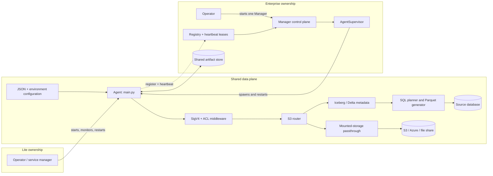
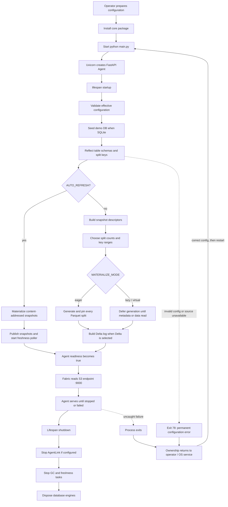
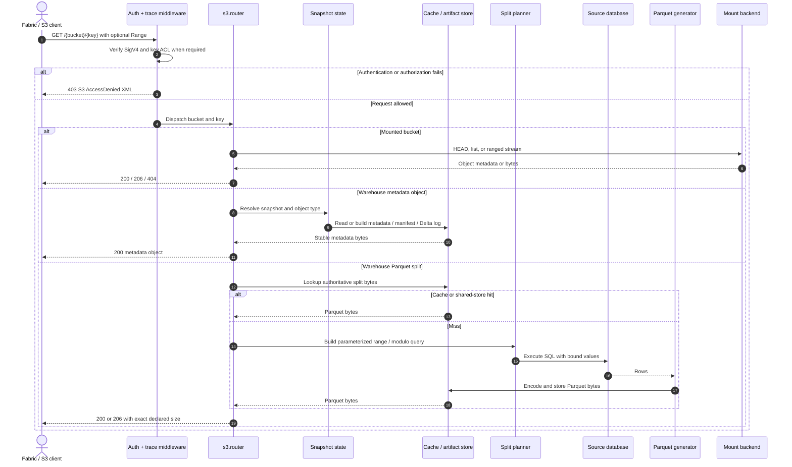
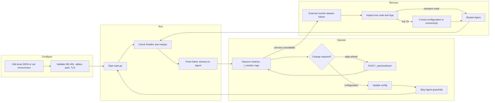
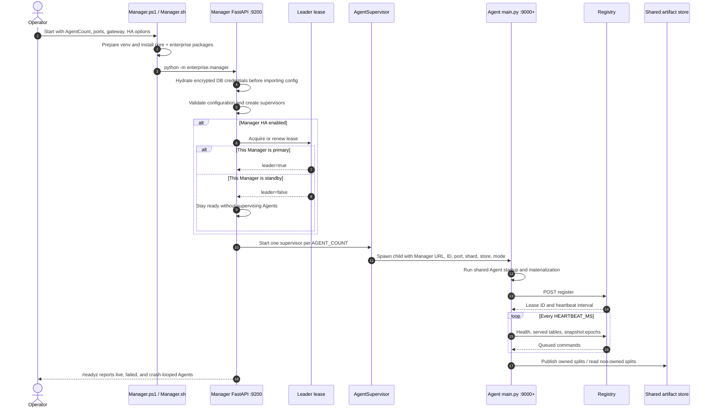
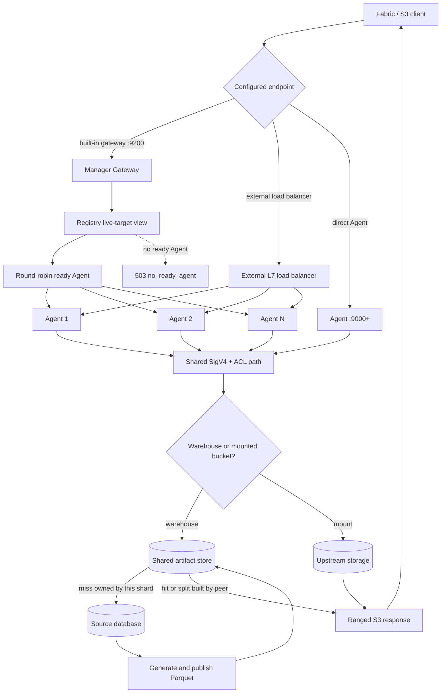
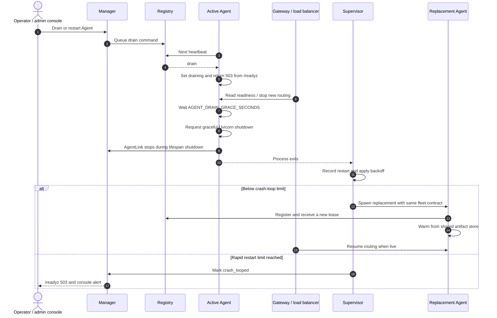
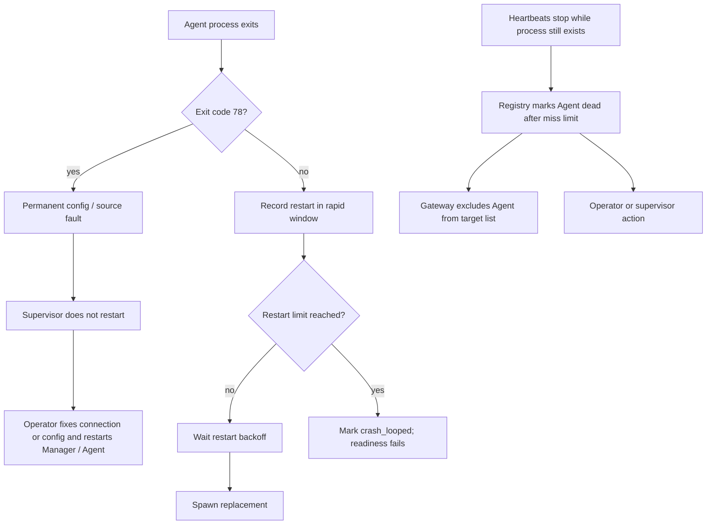
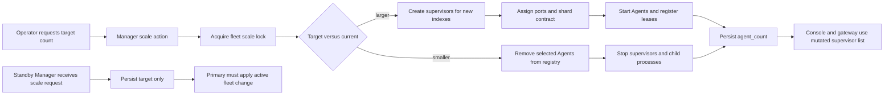
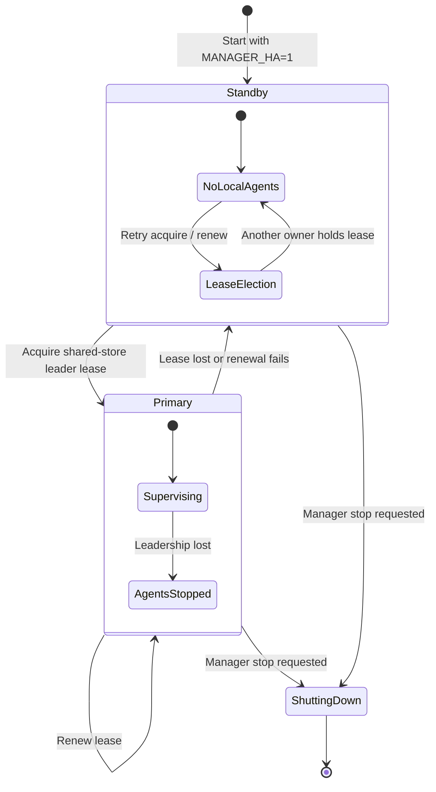

# Lite and Enterprise End-to-End Workflows

This document traces the runtime from installation through startup, Fabric reads,
operations, failure handling, and shutdown. It also marks each ownership handover.
The diagrams reflect the current Python implementation in `main.py`,
`enterprise/manager.py`, and `enterprise/control/`.

## 1. Edition boundary

| Concern | Lite | Enterprise |
| --- | --- | --- |
| Install | `pip install -e .` | `pip install -e . -e ./enterprise` |
| Entrypoint | `python main.py` | `python -m enterprise.manager` or `Manager.ps1` / `Manager.sh` |
| Process owner | Operator, OS service, or container runtime | Manager `AgentSupervisor` |
| Fabric endpoint | Agent port, default `9000` | Agent ports `9000+`, built-in gateway, or external load balancer |
| Admin surface | Optional `/_config` and `/_monitor` on the Agent | `/_manager`, `/_config`, and aggregated `/_monitor` on Manager port `9200` |
| Materialization | One Agent owns all splits | Splits are assigned by shard and published to the shared store |
| Failure recovery | External process owner restarts the Agent | Supervisor restarts children; heartbeat registry removes dead targets from the gateway |
| Scale | One process | `AGENT_COUNT` agents, live scaling, optional Manager HA |

## 2. Lite lifecycle and ownership handover

### Lite handover points

1. **Deployment to process:** the operator hands configuration and credentials to
   `main.py` through environment variables and JSON files.
2. **Process to runtime:** Uvicorn calls the FastAPI lifespan. The Agent validates
   configuration before accepting traffic.
3. **Runtime to serving:** readiness follows schema resolution and the selected
   materialization path. Fabric then owns the request cadence.
4. **Request to source:** the router turns metadata and split requests into
   parameterized source queries, or passes mounted-bucket reads to a storage backend.
5. **Failure to operator:** Lite has no in-process supervisor. Exit code `78`
   identifies a permanent configuration or source-connectivity fault; an external
   service owner decides when to restart.

## 3. Shared S3 request workflow

The same Agent request path is used in both editions. Enterprise changes how the
request reaches an Agent and who controls that Agent.

## 4. Lite operational workflow

## 5. Enterprise bootstrap and control handover

### Control handover contract

The Manager passes these values when it starts each Agent:

| Value | Handover purpose |
| --- | --- |
| `MANAGER_URL` | Enables registration, heartbeat, and command delivery |
| `AGENT_ID` | Stable fleet identity such as `agent-1` |
| `PORT` | Assigns the data-plane listener (`base + shard index`) |
| `AGENT_SHARD_INDEX`, `AGENT_SHARD_COUNT` | Divides cold materialization work |
| `SHARD_STRATEGY` | Keeps split ownership consistent across the fleet |
| `MATERIALIZE_MODE` | Keeps eager, lazy, or virtual behavior fleet-wide |
| `ARTIFACT_STORE_SERVING`, `ARTIFACT_STORE_DIR` | Makes generated objects available to every Agent |
| `ENABLE_MONITOR` | Exposes per-Agent data for Manager aggregation |

The Agent remains a complete S3 server. A Manager outage does not terminate it;
the heartbeat loop catches transport failures and retries. The Manager owns child
process restart only while it is the active supervisor.

## 6. Enterprise request routing

## 7. Enterprise failure, drain, and restart handover

### Failure decisions

## 8. Enterprise live scaling handover

Scaling changes the process count immediately, but existing Agents keep the shard
count passed at their original spawn. Plan a coordinated restart when changing the
fleet size for workloads where every Agent must recalculate split ownership.

## 9. Manager HA ownership transfer

Only the primary starts supervisors. A standby reports ready as a warm spare. On
leadership loss, the former primary stops its Agents before returning to standby;
the new primary starts its own supervised fleet after acquiring the lease.

## 10. Responsibility handover matrix

| Stage | Lite owner | Enterprise owner | Completion signal |
| --- | --- | --- | --- |
| Package and config preparation | Operator | Operator / launcher | Dependencies installed; config files and environment available |
| Credential hydration | Agent configuration load | Manager before config import | Effective DB URLs available without logging secrets |
| Process creation | Operator / OS service | Manager supervisor | Agent PID exists |
| Schema and source validation | Agent | Each Agent | Startup continues; exit `78` on permanent fault |
| Split planning | Single Agent | All Agents with common shard contract | Snapshot descriptors and ranges exist |
| Split generation | Single Agent | Owning shard; peers consume shared bytes | Exact record count and file size stored |
| Client routing | Direct to Agent | Gateway, external LB, or direct Agent | A live Agent receives the request |
| Request authorization | Agent | Selected Agent | Identity attached or S3 `403` returned |
| Warehouse read | Agent | Selected Agent plus shared store | Stable metadata or exact Parquet range returned |
| Mount read | Agent | Selected Agent | Backend stream returned and audit event recorded |
| Health observation | External monitor | Manager registry, supervisor, and monitor proxy | Health/readiness and heartbeat age available |
| Drain | External service removes traffic, then stops Agent | Manager command rides heartbeat; Agent flips readiness | No new traffic; grace period expires |
| Crash recovery | External process owner | Supervisor with backoff and crash-loop guard | Replacement registers a new lease |
| Permanent config recovery | Operator | Operator; Manager remains available | Config fixed, then Agent or Manager restarted |
| Final shutdown | Operator stops Agent | Manager stops all supervisors, then Uvicorn | Background tasks stop and DB engines dispose |

## 11. Source modules

- `main.py`: Agent startup, materialization, middleware, readiness, drain, and shutdown.
- `s3/router.py`: S3 list, head, metadata, split, range, and mount routing.
- `enterprise/manager.py`: Manager process entrypoint and credential hydration.
- `enterprise/control/manager_app.py`: supervisor construction, HA, gateway, scaling,
  admin surfaces, and Manager lifespan.
- `enterprise/control/supervisor.py`: child spawn, restart, memory checks, exit `78`
  handling, backoff, and crash-loop guard.
- `enterprise/agent_link.py`: registration, heartbeat, stale-lease recovery, and drain.
- `enterprise/control/registry.py`: leases, liveness, epochs, and command queues.
- `enterprise/control/gateway.py`: ready-target selection and streamed reverse proxy.
- `runtime/artifact_store.py`: shared object contract used by enterprise Agents.
