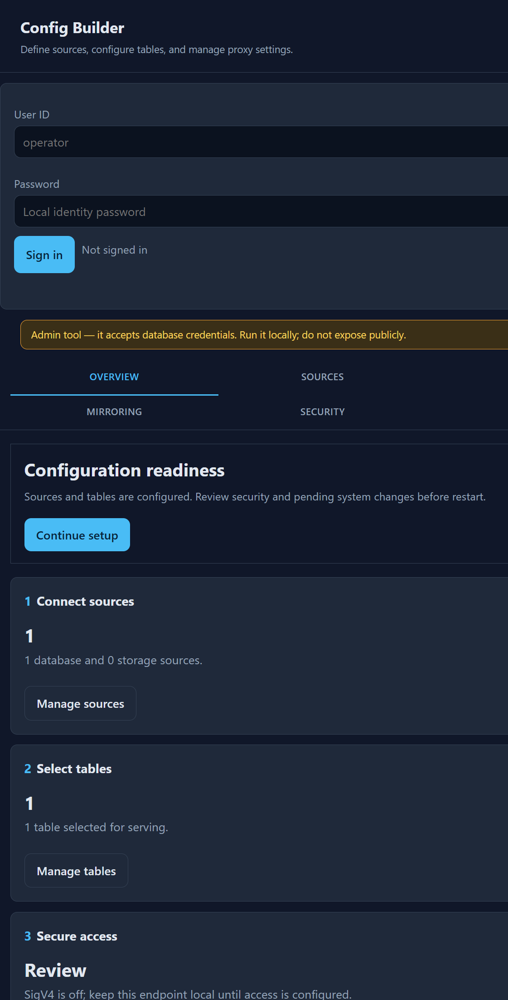
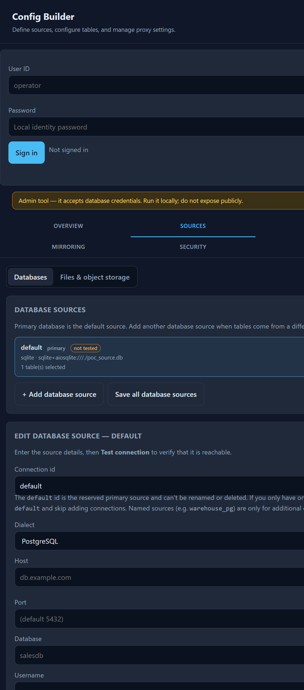
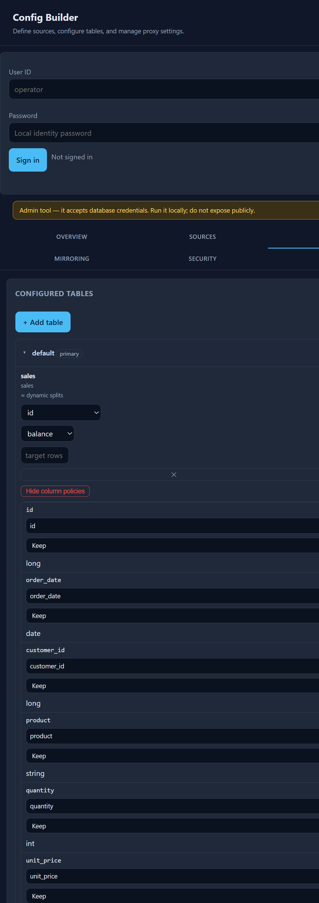
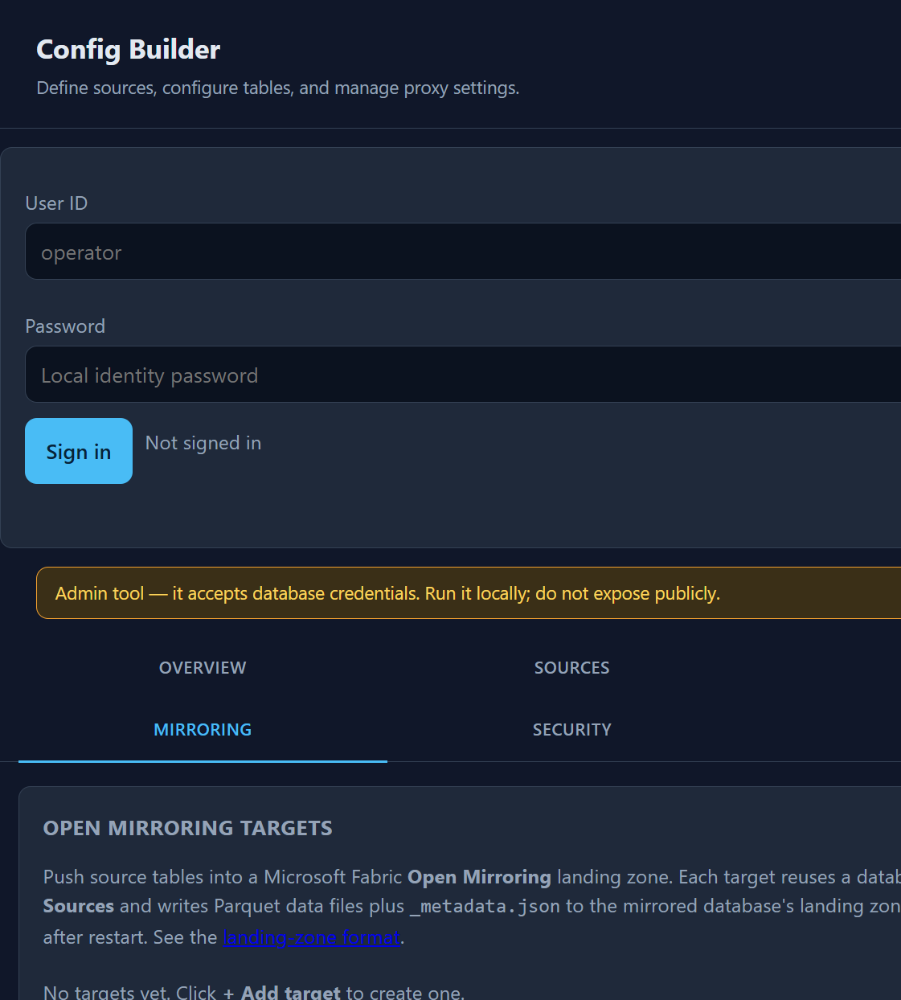
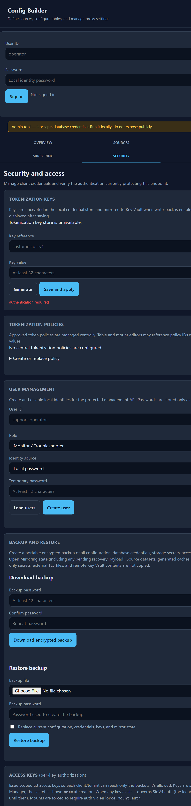
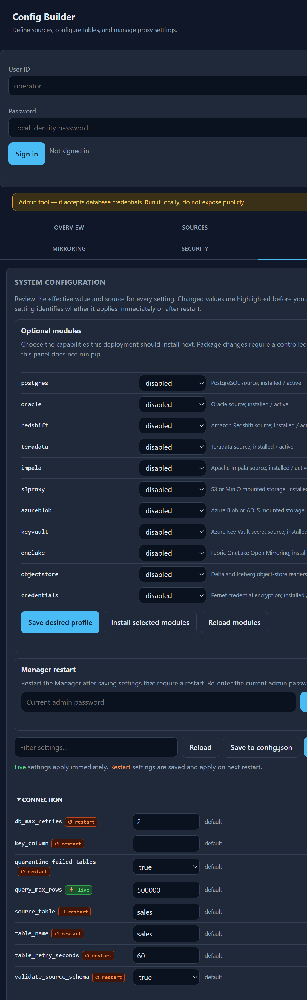

# Config Builder Guide

The Config Builder is the browser interface for sources, served tables, Open
Mirroring targets, tokenization policies, credentials, and runtime settings. It
writes the split `config.*.json` files and encrypted credential store used by the
proxy.

Open `/_config/` on the Lite proxy port or Manager control-plane port. For
example, a local Enterprise Manager normally serves `http://localhost:9200/_config/`.
Keep the page on a private network and configure Manager authentication before
using it outside a local lab.

## 1. Sign in and review readiness

Sign in with a local identity or the configured Manager credentials. An OIDC
bearer token can also identify an operator when OIDC is configured. The Overview
page shows the number of sources and tables, the current security posture, and
whether a restart is needed.

The page can display controls that your current account cannot use. The server
still enforces every request. A monitor or troubleshooter can inspect health but
cannot save configuration, credentials, policies, or users.

## 2. Add and test sources

Open **Sources**, choose **Databases**, then select the default source or **Add
database source**. The default source is the primary connection. Add named
sources only when tables use another database or dialect.

Choose the dialect, host, database, and authentication method. For Databricks,
enter the SQL warehouse HTTP path. Select **Test connection** before saving. A
test checks the driver, network route, credentials, and source response; it does
not publish a table.

Select **Save source** to store a credential in the encrypted credential store.
The password is not returned to the browser after saving. Use **Save all database
sources** when staged changes span several sources.

Use **Files & object storage** in the same tab to configure local, S3-compatible,
or Azure mounts. A mount bucket must not reuse the warehouse bucket name.

## 3. Select tables and splits

Open **Tables**. Tables are grouped by source. Expand a source to change a table's
split key, strategy, balance, split count, and target rows.

Choose a stable key. Use `range` for large integer keys, `date` for temporal
keys, and `modulo` for predictable full scans. `auto` selects an eligible strategy.
Use `count` balance for skewed keys when the source supports the required planning
query. A disabled table remains in configuration but is not resolved or published.

Select **Apply table changes** after edits. A source, table, split, output-format,
or schema change generally requires a Manager restart before every process uses
the new configuration.

## 4. Configure column policies

In an expanded table, select **Edit column policies**. The split key is locked to
**Keep**. For each other column, select Keep, Deterministic token, Random token,
or Remove, and set the output name when needed.

**Remove** omits the column from the published schema and Parquet output.
**Deterministic token** preserves equality for normalized values. **Random token**
changes on every source read and cannot be used with content-hash refresh.

Token options are unavailable until an approved central policy exists. Create a
key and policy in Security first, then return to this editor and select the policy
that matches the chosen token type.

## 5. Configure Open Mirroring

Open **Mirroring** to configure Fabric Open Mirroring landing-zone targets. Each
target references a database source from **Sources**. Add a target, choose its
source connection, Fabric workspace and mirrored database, landing-zone root,
and the source tables to publish.

Use a non-null watermark that advances for every source change when incremental
upserts are required. Omit the watermark only when a full snapshot scan and delete
detection are acceptable. Before the first run, select **Check health** in the
target editor. It verifies source access, control columns, landing-zone access,
Manager credentials, and Fabric mirror status without writing data.

Save the target before selecting **Dry run** or **Publish saved targets**. The
publish actions use saved targets and return a background job. The page keeps its
latest job state while the Manager remains running.

## 6. Manage keys, policies, and access

Open **Security** to manage encrypted credentials and privileged configuration.
These controls require the matching function permission.

### Tokenization keys

Enter a logical key reference, such as `customer-pii-v1`, and a key value, then
select **Save and apply**. The store encrypts the value and shows only its status
later. A durable policy references this logical name; the policy file never
contains the key value.

### Tokenization policies

Create an approved durable or random policy. A durable policy needs a key
reference, domain, and normalization rule. A random policy has no key reference.
Choose the policy from a table, mount, or mirror column editor after it is saved.
Disable a policy instead of deleting it when historical snapshots or configuration
still identify it.

### User and access-key management

Create local users with a role and a password of at least 12 characters, or create
an OIDC subject without a local password. Roles grant named functions; do not use
an OIDC token role claim as a proxy permission.

Create a scoped S3 access key for each Fabric client or tenant. The key secret is
shown once at creation. Restrict its allowed buckets and prefixes, then store the
secret in the Fabric connection.

### Backup and restore

Download a password-encrypted backup before a broad configuration change. Restore
replaces configuration, credentials, access keys, and mirror state only after an
explicit confirmation. Restart the Manager after a successful restore.

## 7. Review and apply runtime settings

Open **System** to inspect effective settings and save staged changes. Values from
the process environment override values saved in config files. The page identifies
an active environment override; saving the JSON file does not change that running
value.

A restart is required for structural settings such as listener ports, source URLs,
TLS files, Agent count, materialization mode, and Manager authentication. Cache,
split, and selected observability settings can be live, but confirm their status
in the saved response before relying on them.

## 8. Verify after changes

1. Confirm `/_config/api/authorization/me` shows the expected identity and permissions.
2. Check `/healthz` and `/readyz` after a restart.
3. Use `/_admin/objects?table=<name>` when Fabric reports an object-size mismatch.
4. Use the Manager monitor to inspect Agent registration, source errors, memory, and Open Mirroring jobs.
5. Run the relevant tokenization or Open Mirror UAT before production rollout.

See [Chapter 5: Configuration](manual/05-configuration.md) for configuration
precedence, [Chapter 13: Open Mirroring](manual/13-open-mirroring.md) for the
publishing contract, and [Chapter 14: Tokenization policies](manual/14-tokenization-policies.md)
for policy lifecycle and rotation.
