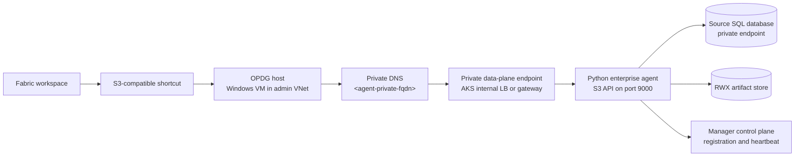
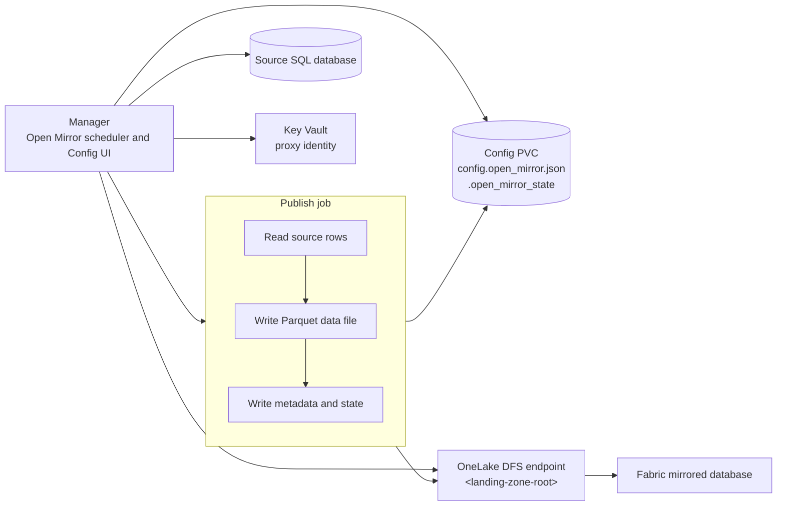
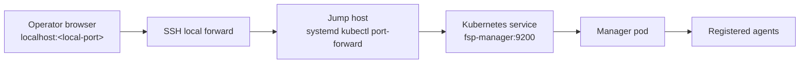
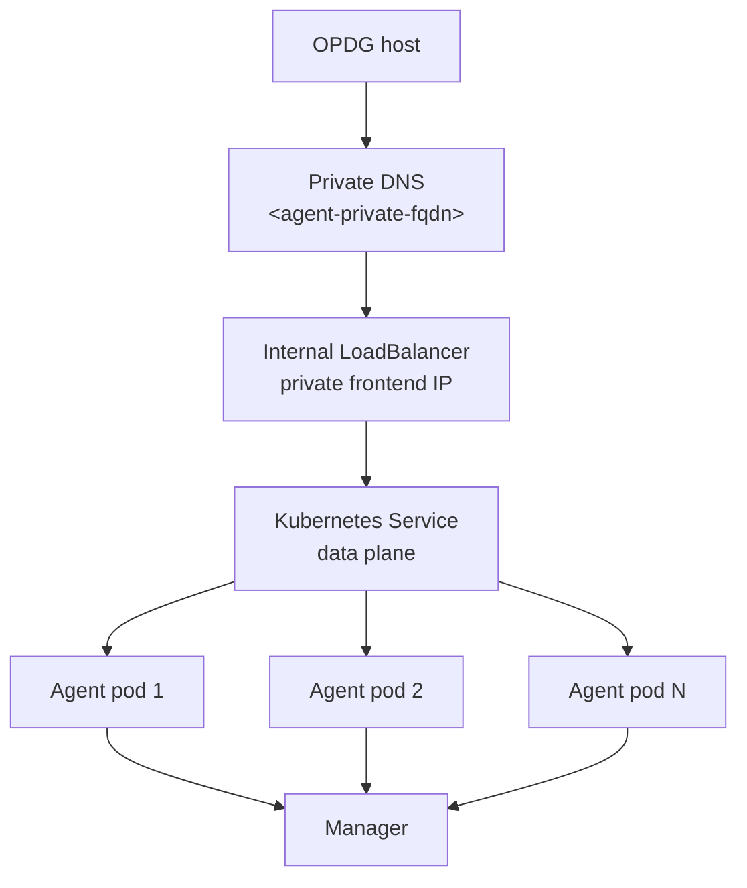
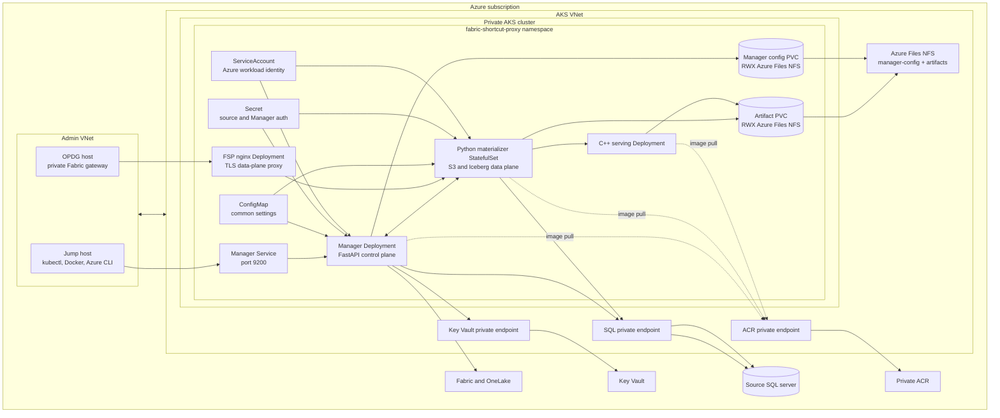
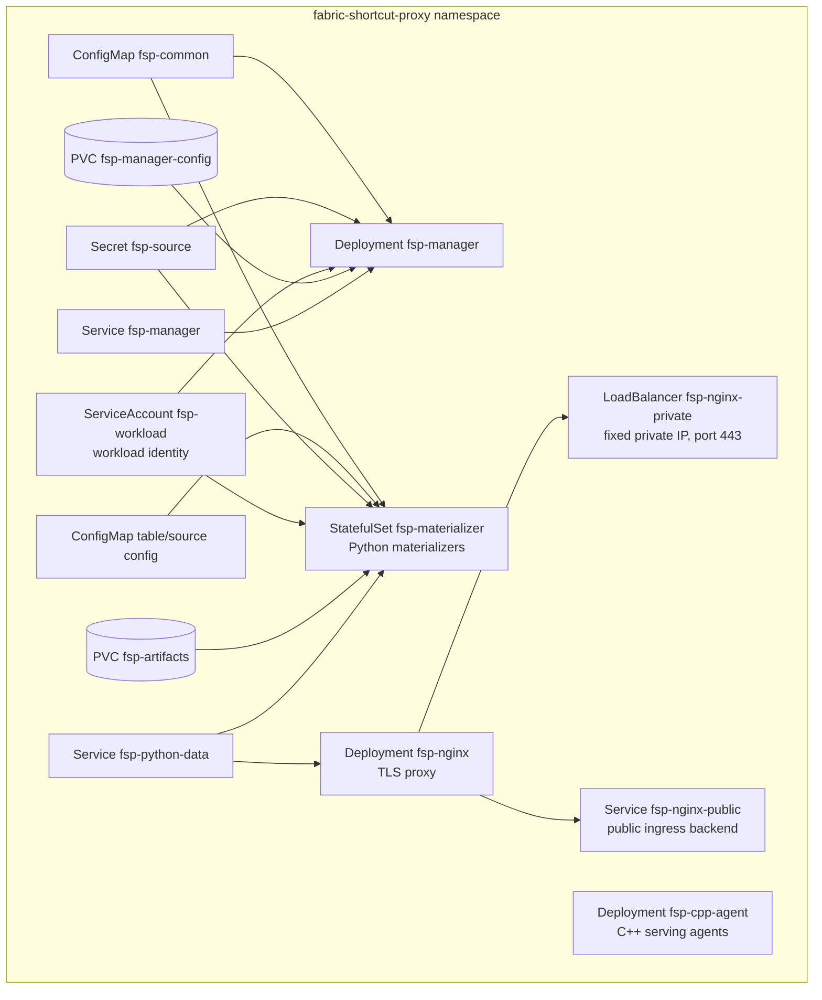
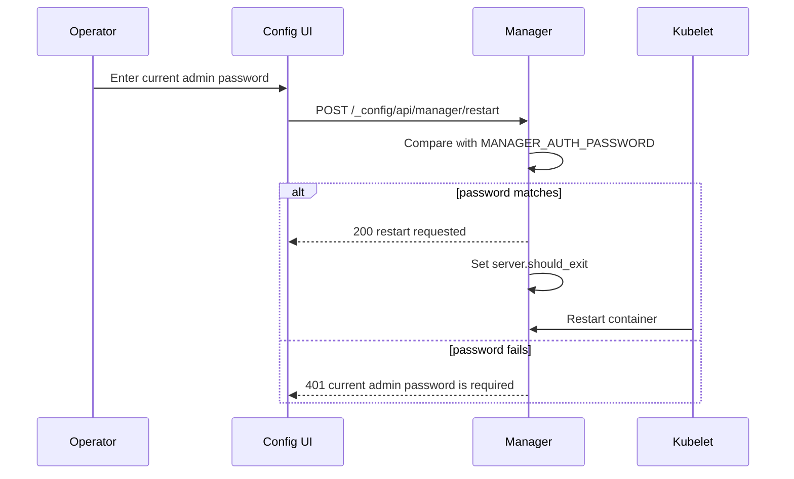
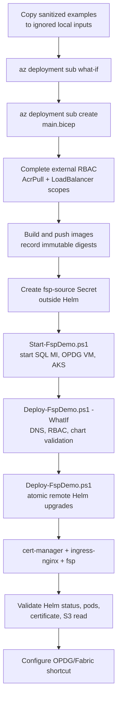

# Enterprise Deployment Guide

This guide describes the enterprise AKS deployment pattern for Fabric Shortcut Proxy. It is written from the validated branch state and uses placeholders for every environment-specific value. Do not paste live tenant IDs, subscription IDs, hostnames, public IPs, private IPs, database names, registry names, or secrets into this document.

The executable runbook is [infra/fsp-demo/README.md](../infra/fsp-demo/README.md). This document
explains the topology and design choices. The production workload definition is the
[Helm chart](../deploy/helm/fabric-shortcut-proxy/README.md); Kustomize overlays under
`deploy/kubernetes` are development and validation proofs.

Use this guide for a private Azure deployment where:

- The Manager runs in AKS as the control plane.
- Python enterprise agents register with the Manager and serve an S3-compatible Iceberg data plane.
- Open Mirroring can publish source rows into a Fabric OneLake landing zone.
- Key Vault stores or mirrors secrets through the proxy identity.
- An On-Premises Data Gateway host or another private client reaches the data plane over VNet peering or a private load balancer.

## Placeholder convention

Replace the placeholders below with values from your tenant during deployment. Keep populated files outside source control.

| Placeholder | Meaning |
| --- | --- |
| `<subscription-id>` | Azure subscription ID. |
| `<tenant-id>` | Microsoft Entra tenant ID. |
| `<location>` | Azure region, for example `<region-name>`. |
| `<resource-group>` | Resource group for production FSP resources. |
| `<aks-cluster>` | Private AKS cluster name. |
| `<aks-vnet>` | AKS virtual network name. |
| `<aks-app-subnet>` | Subnet for application nodes and internal load balancers. |
| `<admin-vnet>` | VNet containing the jump host and OPDG host. |
| `<jump-host>` | Private administration VM with Azure CLI, kubectl, and Docker. |
| `<opdg-host>` | Windows host running On-Premises Data Gateway. |
| `<registry-name>` | Private Azure Container Registry name. |
| `<registry-login-server>` | ACR login server, for example `<registry-name>.azurecr.io`. |
| `<key-vault-name>` | Azure Key Vault name. |
| `<source-sql-host>` | Private SQL source host or private endpoint DNS name. |
| `<source-database>` | Source database name. |
| `<manager-private-fqdn>` | Private DNS name for Manager administration. |
| `<agent-private-fqdn>` | Private DNS name for the S3 data-plane endpoint. |
| `<storage-account>` | Premium Azure Files account that owns the NFS shares. |
| `<artifact-share>` | RWX Azure Files NFS share for artifacts. |
| `<manager-config-share>` | RWX Azure Files NFS share for Manager configuration and state. |
| `<workspace-id>` | Fabric workspace ID. |
| `<mirrored-database-id>` | Fabric mirrored database ID. |
| `<landing-zone-root>` | OneLake landing-zone URL for Open Mirroring. |

## Deployment scenarios

### Scenario A: Private S3-compatible shortcut through OPDG

Fabric uses an Amazon S3 Compatible shortcut. The OPDG host resolves the private data-plane DNS name and connects to the proxy over the private network. Fabric never connects to the AKS endpoint directly.



### Scenario B: Open Mirroring to OneLake

The Manager owns Open Mirror target configuration and publish state. A publish job reads source rows, writes landing-zone files, and records cursor state under the Manager config volume.



### Scenario C: Manager administration through a jump host

A jump host can keep a stable kubectl port-forward to the Manager service. Operators create a local SSH tunnel to the jump host and browse the Manager, Monitor, and Config UI on localhost.



### Scenario D: Stable private endpoint for OPDG

For production, do not point DNS at a pod IP. Use an internal LoadBalancer, private ingress, or gateway service. DNS should point at a stable private frontend IP.



## Component architecture



## Network requirements

The deployment needs private connectivity between the administration VNet, the AKS VNet, private endpoints, and Fabric gateway host.

| Path | Required result |
| --- | --- |
| OPDG host to data-plane endpoint | TCP to port `9000` or the service port succeeds. |
| Jump host to Manager endpoint | TCP to port `9200` succeeds. |
| AKS pods to source SQL private endpoint | DNS resolves privately and TCP to `1433` succeeds for SQL Server. |
| AKS pods to Key Vault | `<key-vault-name>.vault.azure.net` resolves through `privatelink.vaultcore.azure.net`. |
| AKS pods to private ACR | `<registry-login-server>` resolves through `privatelink.azurecr.io`. |
| Manager to OneLake | HTTPS to `onelake.dfs.fabric.microsoft.com` succeeds with Entra auth. |

### VNet peering

Peer the administration VNet and AKS VNet in both directions.

```bash
az network vnet peering create \
  --resource-group <admin-vnet-resource-group> \
  --vnet-name <admin-vnet> \
  --name <admin-to-aks-peering> \
  --remote-vnet <aks-vnet-resource-id> \
  --allow-vnet-access \
  --allow-forwarded-traffic

az network vnet peering create \
  --resource-group <resource-group> \
  --vnet-name <aks-vnet> \
  --name <aks-to-admin-peering> \
  --remote-vnet <admin-vnet-resource-id> \
  --allow-vnet-access \
  --allow-forwarded-traffic
```

### Private DNS links

Link these zones to the VNets that need name resolution.

| Zone | Link to AKS VNet | Link to admin VNet | Purpose |
| --- | ---: | ---: | --- |
| `privatelink.<region>.azmk8s.io` | Optional | Yes | Private AKS API access from jump host. |
| `privatelink.azurecr.io` | Yes | Optional | Private ACR image pulls and builds. |
| `privatelink.database.windows.net` | Yes | Yes when OPDG or jump host tests SQL | Azure SQL private endpoint. |
| `privatelink.vaultcore.azure.net` | Yes | Yes when jump host tests Key Vault | Key Vault private endpoint. |
| `<private-zone>` | Yes | Yes | Private names such as `<manager-private-fqdn>` and `<agent-private-fqdn>`. |

## Storage design

Use separate storage for control-plane configuration and data-plane artifacts.

| Storage | Kubernetes access | Purpose |
| --- | --- | --- |
| Manager config PVC | RWX | `config.*.json`, encrypted credential store, Open Mirror state. |
| Artifact PVC | RWX | Shared Iceberg/Delta artifact store for materializers and serving Agents. |
| Azure Files NFS | RWX backend | Static `manager-config` and `artifacts` shares created by Bicep. |

For NFS-backed artifact storage, validate permissions with the same UID/GID used by the pods. If pods run as non-root, the export must allow that identity to traverse and write the mount.

```bash
kubectl -n fabric-shortcut-proxy exec deployment/<agent-deployment> -- sh -c '
  id
  ls -ld /artifacts
  touch /artifacts/.write-test && rm /artifacts/.write-test
'
```

## Identity and secrets

Use one user-assigned workload identity for Azure operations. Bicep creates the identity and
federated credential for the `fsp-workload` ServiceAccount; Helm applies the ServiceAccount
annotation and workload labels. No Azure client secret is required for the validated pattern.

| Setting | Storage | Notes |
| --- | --- | --- |
| `FSP_AUTH_MODE` | ConfigMap or config file | `managed_identity` in the enterprise demo. |
| `AZURE_TENANT_ID` | ConfigMap or config file | Non-secret identifier. |
| `AZURE_CLIENT_ID` | ConfigMap or config file | Non-secret application or managed identity ID. |
| `FSP_KEYVAULT_URI` | ConfigMap or config file | `https://<key-vault-name>.vault.azure.net/`. |
| `MANAGER_AUTH_PASSWORD` | Kubernetes Secret | Protects Manager, Monitor, and Config UI. |

The Helm chart references an existing `fsp-source` Secret for source and Manager credentials.
Create it through the approved secret-delivery process before running `Deploy-FspDemo.ps1`.
The chart never templates credential values.

## Container images

Build the Python enterprise image with the default extras and the SQL Server ODBC driver when SQL Server is a source.

```bash
docker build \
  --build-arg FSP_ENTERPRISE=1 \
  --build-arg FSP_INSTALL_MSSQL_ODBC=1 \
  -f Dockerfile.python \
  -t <registry-login-server>/fabric-shortcut-proxy-python:<tag> .

docker push <registry-login-server>/fabric-shortcut-proxy-python:<tag>
```

Use an immutable digest in production manifests:

```text
<registry-login-server>/fabric-shortcut-proxy-python@sha256:<image-digest>
```

The default image extras are:

```text
postgres,azureblob,keyvault,onelake
```

These install Azure Identity, Key Vault Secrets, Azure Blob/ADLS clients, and OneLake Data Lake clients. SQL Server uses core Python packages plus the OS ODBC driver.

## Kubernetes namespace layout



## Manager deployment

The Manager runs external supervision mode in AKS. Kubernetes owns pod lifecycle. The Manager tracks registered agents through `/control/register` and `/control/heartbeat`.

Required settings:

```yaml
env:
  - name: CONTROL_HOST
    value: 0.0.0.0
  - name: CONTROL_PORT
    value: "9200"
  - name: MANAGER_SUPERVISION_MODE
    value: external
  - name: ENABLE_GATEWAY
    value: "0"
  - name: ENABLE_CONFIG_BUILDER
    value: "1"
  - name: ENABLE_MONITOR
    value: "1"
  - name: ENABLE_ADMIN_UI
    value: "1"
  - name: FSP_CONFIG_DIR
    value: /config
  - name: CREDENTIAL_STORE_PATH
    value: /config/credentials.json
  - name: OPEN_MIRROR_STATE_DIR
    value: /config/.open_mirror_state
```

Use `/healthz` for Manager readiness. `/readyz` is fleet readiness and can return non-200 when no agents are registered.

## Agent deployment

The Python agent must advertise a routable IP or DNS name that the Manager and gateway can use.

The Helm chart creates a headless `fsp-materializer` Service for StatefulSet identity, an
internal `fsp-python-data` Service for nginx, and the `fsp-nginx-private` Azure internal
LoadBalancer on port `443`. Its private IP and subnet come from local Helm values and must match
the Bicep network contract.

```powershell
./infra/fsp-demo/Deploy-FspDemo.ps1 -WhatIf
./infra/fsp-demo/Deploy-FspDemo.ps1
az aks command invoke --resource-group <resource-group> --name <aks-cluster> `
  --command "kubectl -n fabric-shortcut-proxy get svc fsp-nginx-private -o wide"
```

Create the private DNS A record for `<agent-private-fqdn>` at that fixed private IP and configure
OPDG or another private client for `https://<agent-private-fqdn>`. Do not use a pod IP, Manager
frontend, or ClusterIP.

Stopping and starting AKS causes an outage while nodes and pods return, but it does not normally
recreate the LoadBalancer frontend. The chart requests a fixed private IP, so a failed
reconciliation usually indicates subnet or AKS identity permissions rather than a new address.

For AKS pods, use the pod IP for registration:

```yaml
env:
  - name: HOST
    valueFrom:
      fieldRef:
        fieldPath: status.podIP
  - name: AGENT_ADVERTISE_HOST
    valueFrom:
      fieldRef:
        fieldPath: status.podIP
  - name: PORT
    value: "9000"
  - name: MANAGER_URL
    value: http://fsp-manager:9200
  - name: MATERIALIZE_MODE
    value: lazy
  - name: PUBLISH_SERVING_IMAGE
    value: "0"
  - name: REQUIRE_SIGV4
    value: "0"
  - name: ENABLE_CREDENTIAL_STORE
    value: "0"
```

The validated Helm values use workload identity for Azure SDK access. If a separate SQL source
requires service-principal ODBC authentication, build the runtime connection URL from a
secret-safe `odbc_connect` string. This optional source credential is distinct from the
pod's workload identity.

```bash
odbc_connect=$(python -c 'import os, urllib.parse; secret=os.environ["AZURE_CLIENT_SECRET"].replace("}", "}}"); conn="Driver={ODBC Driver 18 for SQL Server};Server=tcp:<source-sql-host>,1433;Database=<source-database>;Authentication=ActiveDirectoryServicePrincipal;UID="+os.environ["AZURE_CLIENT_ID"]+";PWD={"+secret+"};Encrypt=yes;TrustServerCertificate=yes"; print(urllib.parse.quote_plus(conn))')
export DB_URL="mssql+aioodbc:///?odbc_connect=${odbc_connect}"
export DB_URL_<SOURCE_ID>="$DB_URL"
exec python -m main
```

The canonical S3 path parser reads `Server` and `Database` from `odbc_connect`, so object keys use:

```text
<warehouse-prefix>/<source-sql-host>/<source-database>/<schema>/<object>/...
```

## Stable private data-plane DNS

A pod IP is acceptable only for a short smoke test. For production, use one of these stable patterns:

| Pattern | DNS target | Notes |
| --- | --- | --- |
| Internal LoadBalancer | Private frontend IP | Recommended for OPDG. Requires AKS identity network permissions. |
| Private ingress | Private ingress IP | Use when TLS or host routing is needed. |
| Gateway service | Private gateway IP | Use when one data-plane endpoint fronts multiple agents. |
| Temporary A record to pod IP | Pod IP | Smoke test only; update after every pod restart. |

Configure the chart's internal LoadBalancer rather than applying a second Service:

```yaml
nginx:
  enabled: true
  privateService:
    enabled: true
    subnet: <aks-app-subnet>
    ipAddress: <data-plane-private-ip>
tls:
  enabled: true
  hostname: <agent-private-fqdn>
```

The AKS control-plane identity needs permission to create internal load balancers and join the subnet:

```bash
az role assignment create \
  --assignee <aks-control-plane-principal-id> \
  --role "Network Contributor" \
  --scope <aks-vnet-resource-id>

az role assignment create \
  --assignee <aks-control-plane-principal-id> \
  --role "Network Contributor" \
  --scope <aks-app-subnet-resource-id>
```

After Azure allocates a private frontend IP, create a private DNS record:

```bash
az network private-dns record-set a create \
  --resource-group <dns-resource-group> \
  --zone-name <private-zone> \
  --name <agent-record-name> \
  --ttl 30

az network private-dns record-set a add-record \
  --resource-group <dns-resource-group> \
  --zone-name <private-zone> \
  --record-set-name <agent-record-name> \
  --ipv4-address <data-plane-private-ip>
```

## Config UI and Manager operations

The Manager exposes:

| Path | Purpose |
| --- | --- |
| `/_manager/` | Fleet view and drain actions. |
| `/_monitor/` | Health, S3 read stats, Open Mirror stats. |
| `/_config/` | Sources, tables, security, mirroring, system settings. |
| `/healthz` | Manager process health. |
| `/readyz` | Fleet readiness. |

The Config UI System tab includes a Manager restart control. It requires the current Manager admin password in the request body. A wrong password returns `401`. A correct password causes the Manager process to exit gracefully; Kubernetes restarts the container.



## Key Vault integration

Key Vault requires both packages and private network path.

Checklist:

1. The image includes the `keyvault` extra.
2. `FSP_KEYVAULT_URI` points to `https://<key-vault-name>.vault.azure.net/`.
3. `FSP_AUTH_MODE`, `AZURE_TENANT_ID`, and `AZURE_CLIENT_ID` match the proxy identity.
4. `AZURE_CLIENT_SECRET` exists only in a Kubernetes Secret when service-principal auth is used.
5. `privatelink.vaultcore.azure.net` is linked to the AKS VNet.
6. The proxy identity has Key Vault data-plane permission through Azure RBAC or access policy, matching the vault mode.

Validate from the Manager pod without printing existing secret values:

```bash
kubectl -n fabric-shortcut-proxy exec deployment/fsp-manager -- python - <<'PY'
from security import keyvault as kv
import config
cfg = kv.config_from_settings(config)
source = kv.KeyVaultSecretSource(cfg)
print(source.probe())
PY
```

Run a disposable write/read/delete test only in a non-production window and with an agreed naming prefix.

## Open Mirror configuration

Open Mirror targets are stored in `config.open_mirror.json`. In AKS, the loader reads this file from `FSP_CONFIG_DIR`, so the file belongs on the Manager config PVC.

Example shape with placeholders:

```json
{
  "open_mirror": {
    "open_mirror_targets": [
      {
        "id": "<mirror-target-id>",
        "connection": "<source-id>",
        "landing_zone_root": "<landing-zone-root>",
        "workspace_id": "<workspace-id>",
        "mirrored_database_id": "<mirrored-database-id>",
        "partner_name": "FabricShortcutProxy",
        "source_type": "SQL",
        "enabled": true,
        "fabric_retention_days": 1,
        "tables": [
          {
            "name": "<source-table-name>",
            "source_table": "<source-schema>.<source-table>",
            "target_table": "<target-table>",
            "schema": "<target-schema>",
            "key_column": "<key-column>",
            "mode": "incremental",
            "watermark_column": "<watermark-column>"
          }
        ]
      }
    ]
  }
}
```

Run a dry-run publish first:

```bash
curl -u <manager-user>:<manager-password> \
  -H 'Content-Type: application/json' \
  -X POST \
  http://<manager-private-fqdn>:9200/_config/api/open-mirror/publish \
  -d '{"target_id":"<mirror-target-id>","dry_run":true}'
```

Then run a real publish:

```bash
curl -u <manager-user>:<manager-password> \
  -H 'Content-Type: application/json' \
  -X POST \
  http://<manager-private-fqdn>:9200/_config/api/open-mirror/publish \
  -d '{"target_id":"<mirror-target-id>","dry_run":false}'
```

Validate through Monitor:

```bash
curl -u <manager-user>:<manager-password> \
  http://<manager-private-fqdn>:9200/_monitor/api/open-mirror
```

Expected fields after the first publish:

```json
{
  "totals": {
    "targets": 1,
    "enabled_targets": 1,
    "initialized_tables": 1,
    "pending_tables": 0,
    "published_rows": "<row-count>",
    "last_batch_rows": "<row-count>"
  }
}
```

The optional landing-zone row counter can fail when OneLake returns directory listing errors. The dashboard keeps the committed publish state and logs the row-count warning instead of failing the whole summary.

## S3 shortcut validation

From a private client such as the OPDG host, validate DNS, TCP, and the S3-compatible tree.

```powershell
Resolve-DnsName <agent-private-fqdn>
Test-NetConnection -ComputerName <agent-private-fqdn> -Port 9000
Invoke-WebRequest -Uri "http://<agent-private-fqdn>:9000/<bucket>?list-type=2&prefix=<warehouse-prefix>/" -UseBasicParsing
```

A canonical SQL Server path should look like this:

```text
<warehouse-prefix>/<source-sql-host>/<source-database>/<schema>/<object>/metadata/v1.metadata.json
<warehouse-prefix>/<source-sql-host>/<source-database>/<schema>/<object>/data/split-0-<snapshot-id>.parquet
```

It should not fall back to:

```text
<warehouse-prefix>/local/default/...
```

Validate metadata and ranged Parquet reads:

```powershell
Invoke-WebRequest -Uri "http://<agent-private-fqdn>:9000/<bucket>/<metadata-key>" -UseBasicParsing
Invoke-WebRequest -Uri "http://<agent-private-fqdn>:9000/<bucket>/<parquet-key>" -Headers @{ Range = "bytes=0-15" } -UseBasicParsing
```

Expected results:

| Check | Expected |
| --- | --- |
| Bucket listing | `200` with metadata and data keys. |
| Metadata GET | `200`. |
| Parquet range GET | `206` with a `Content-Range` header. |
| Manager Fleet | One or more alive registered agents. |
| Monitor | Table count greater than zero after requests. |

## Deployment flow



There is no single all-phases PowerShell orchestrator. Infrastructure what-if/create, runtime
startup, and Helm deployment remain separate review and retry boundaries. See the
[automation runbook](../infra/fsp-demo/README.md).

## Operational checks

Run these after deployment and after every image roll.

```bash
kubectl -n fabric-shortcut-proxy get pods,svc,pvc
kubectl -n fabric-shortcut-proxy get endpointslices
kubectl -n fabric-shortcut-proxy logs deployment/fsp-manager --tail=100
```

Manager checks:

```bash
curl -u <manager-user>:<manager-password> http://<manager-private-fqdn>:9200/_manager/api/fleet
curl -u <manager-user>:<manager-password> http://<manager-private-fqdn>:9200/_monitor/api/summary
curl -u <manager-user>:<manager-password> http://<manager-private-fqdn>:9200/_config/api/keyvault
curl -u <manager-user>:<manager-password> http://<manager-private-fqdn>:9200/_monitor/api/open-mirror
```

Pod-side package checks:

```bash
kubectl -n fabric-shortcut-proxy exec deployment/fsp-manager -- python - <<'PY'
import importlib.util
for name in ["azure.identity", "azure.keyvault.secrets", "azure.storage.blob", "azure.storage.filedatalake", "pyodbc"]:
    print(name, importlib.util.find_spec(name) is not None)
PY
```

## Troubleshooting

### OPDG can reach pod IPs but not ClusterIP

Kubernetes ClusterIP addresses are only routable inside the cluster. Use an internal LoadBalancer, private ingress, gateway service, or NodePort for private clients outside AKS.

### Internal LoadBalancer remains pending

Check service events:

```bash
kubectl -n fabric-shortcut-proxy describe svc <service-name>
```

If events mention `AuthorizationFailed` or `LinkedAuthorizationFailed`, grant the AKS control-plane identity `Network Contributor` on both the AKS VNet and the subnet used by the internal LoadBalancer.

### Key Vault returns ForbiddenByConnection

The pod is reaching the public vault endpoint. Link `privatelink.vaultcore.azure.net` to the AKS VNet and verify pod DNS resolves `<key-vault-name>.vault.azure.net` to a private IP.

### Open Mirror target count is zero

Check that `config.open_mirror.json` exists under `FSP_CONFIG_DIR`, usually `/config/config.open_mirror.json`, and restart the Manager. The loader reads the file from `FSP_CONFIG_DIR` in AKS.

### Canonical paths show local/default

This happens when the connection URL has no normal host/database fields and the runtime cannot infer the source identity. For SQL Server `odbc_connect` URLs, ensure the ODBC string includes `Server=` and `Database=`.

### SSH tunnel shows channel open failed

The local SSH tunnel connected, but the remote side was not listening. Check the jump-host port-forward service:

```bash
systemctl status fsp-manager-portforward.service
ss -ltnp '( sport = :<remote-port> )'
```

### Manager restart from Config UI fails

The restart endpoint requires the current Manager admin password. A browser session that already passed HTTP Basic auth is not enough. Re-enter the password in the System tab restart panel.
