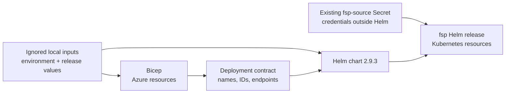

# Enterprise Helm Migration Guide

Version 2.9.3 replaces the ignored enterprise-demo Kustomize deployment with the tracked
[`fabric-shortcut-proxy`](../deploy/helm/fabric-shortcut-proxy/README.md) Helm chart.
The local Kind and focused AKS validation overlays remain available for development tests.

## What changed

| Before | After |
| --- | --- |
| Environment values embedded in ignored YAML | Sanitized examples plus ignored local Helm values |
| Kustomize apply with no release state | `helm upgrade --install` with revision history |
| Bicep source hidden by a blanket ignore | Parameterized Bicep source tracked; local parameters ignored |
| Manual cert-manager and ingress manifest application | Pinned cert-manager and ingress-nginx Helm releases |
| Workload manifests and infrastructure names coupled | Bicep deployment contract and Helm values form an explicit boundary |

The FSP chart renders 27 resources for the enterprise example. It includes the Manager,
Python materializers, C++ serving Agents, nginx proxy, network policies, Azure Files volumes,
cert-manager resources, and ingress routes.

## Ownership boundaries



Bicep does not create Kubernetes credentials. Helm does not provision Azure infrastructure.
`Start-FspDemo.ps1` starts existing dependencies but does not provision or upgrade them.

## Prepare local inputs

From the repository root:

```powershell
Copy-Item infra/fsp-demo/main.example.bicepparam infra/fsp-demo/main.local.bicepparam
Copy-Item infra/fsp-demo/deployment.example.json infra/fsp-demo/deployment.local.json
Copy-Item infra/fsp-demo/ingress-nginx-values.example.yaml infra/fsp-demo/ingress-nginx-values.local.yaml
Copy-Item deploy/helm/fabric-shortcut-proxy/values-enterprise-demo.example.yaml `
  deploy/helm/fabric-shortcut-proxy/values-enterprise-demo.local.yaml
```

Populate the local files with the target subscription, tenant, resource IDs, hostnames,
app-registration IDs, storage names, and immutable image digests. The ignore rules cover only
these local inputs and generated `infra/fsp-demo/main.json`.

[`main.local.bicepparam`](../infra/fsp-demo/main.example.bicepparam) is created from the
committed Bicep parameter example.
[`values-enterprise-demo.local.yaml`](../deploy/helm/fabric-shortcut-proxy/values-enterprise-demo.example.yaml)
is created from the committed enterprise values example. The link targets are templates, not
populated environment files.

Do not put database URLs, passwords, tokens, private keys, or client secrets in Helm values.
Create the configured `fsp-source` Secret through the approved secret-delivery process.

## Validate before adoption

Install Helm 3.18.6 in Windows PowerShell or let `Deploy-FspDemo.ps1` download and verify the
pinned binary for that run.

```powershell
winget install --id Helm.Helm --exact --version 3.18.6
helm lint deploy/helm/fabric-shortcut-proxy `
  -f deploy/helm/fabric-shortcut-proxy/values-enterprise-demo.local.yaml
helm template fsp deploy/helm/fabric-shortcut-proxy `
  -f deploy/helm/fabric-shortcut-proxy/values-enterprise-demo.local.yaml `
  --namespace fabric-shortcut-proxy
```

The enterprise render must contain 27 resources and immutable Python, C++, and nginx image
digests. Run the Azure preview independently:

```powershell
az deployment sub what-if `
  --name fsp-demo-whatif `
  --location <region> `
  --template-file infra/fsp-demo/main.bicep `
  --parameters infra/fsp-demo/main.local.bicepparam
```

## First Helm adoption

`Deploy-FspDemo.ps1` uses `--take-ownership`. Helm adds release metadata to matching resources
that were previously applied by Kustomize. Resource names and namespaces must match before the
first adoption.

```powershell
./infra/fsp-demo/Start-FspDemo.ps1 -SkipWorkloadValidation
./infra/fsp-demo/Deploy-FspDemo.ps1 -WhatIf
./infra/fsp-demo/Deploy-FspDemo.ps1
```

The deployment script performs these steps:

1. Validates Azure account, AKS state, DNS, and Network Contributor assignments.
2. Downloads Helm 3.18.6 when the installed version differs.
3. Lints, renders, and packages the local FSP chart.
4. Confirms the remote AKS Run Command Helm supports `--take-ownership`.
5. Atomically upgrades cert-manager, ingress-nginx, and FSP.
6. Waits for the certificate and reports Helm release status.

AKS Run Command supplies `kubectl` and Helm inside a transient pod, so the workstation does not
need a network route to the private API server.

## Retained resources

The Namespace, persistent volumes, and persistent claims carry
`helm.sh/resource-policy: keep`. `helm uninstall fsp` therefore leaves retained state behind.
This is intentional. Delete those resources only through a separate data-retention decision.

The Bicep Azure Files shares also use retained storage semantics. A release rollback must not
replace or delete Manager configuration or artifact storage.

## Verify adoption

```powershell
az aks command invoke `
  --resource-group <resource-group> `
  --name <aks-name> `
  --command "helm list -A && helm status fsp -n fabric-shortcut-proxy && kubectl -n fabric-shortcut-proxy get pods,svc,pvc,ingress,certificate"
```

Check that:

- All workloads become ready without repeated restarts.
- `fsp-nginx-private` owns the configured private IP on port 443.
- The certificate is Ready.
- Manager reports registered materializers.
- An authenticated S3 metadata GET and ranged Parquet GET succeed.

## Upgrade and rollback

Use the same deployment script for upgrades. Change local image digests or values, render and
review locally, then run `Deploy-FspDemo.ps1 -WhatIf` and the deployment.

Helm keeps release history. To inspect or roll back through AKS Run Command:

```powershell
az aks command invoke --resource-group <resource-group> --name <aks-name> `
  --command "helm history fsp -n fabric-shortcut-proxy"
az aks command invoke --resource-group <resource-group> --name <aks-name> `
  --command "helm rollback fsp <revision> -n fabric-shortcut-proxy --wait --timeout 15m"
```

A Helm rollback changes Kubernetes resources. It does not roll back Bicep, database state,
Key Vault contents, or files already written to retained Azure Files shares.

## Troubleshooting

### Helm refuses ownership

Confirm the existing resource identity matches the chart and the remote Helm exposes
`--take-ownership`. Do not delete PVCs to resolve an ownership-label error.

### A release is stuck pending

Inspect `helm history`, release Secrets in the namespace, and pod events. `--atomic` rolls back a
failed upgrade, but external LoadBalancer or certificate reconciliation can consume most of the
timeout.

### Private LoadBalancer remains pending

Verify the configured IP belongs to the application subnet and that the AKS control-plane
identity has Network Contributor on the public IP, application subnet, and its NSG as required by
the deployment runbook.

### nginx cannot mount TLS

The chart requires `nginx.enabled` and `tls.enabled` to be changed together. Verify cert-manager
is installed and the `fsp-nginx-tls` Certificate reports Ready.

### Local values are ignored by Git

That is expected. Recreate them from the committed examples on each authorized operator machine.
Do not force-add populated local inputs.

## References

- [Enterprise automation runbook](../infra/fsp-demo/README.md)
- [Helm chart reference](../deploy/helm/fabric-shortcut-proxy/README.md)
- [Enterprise deployment design](Enterprise_Deployment_guide.md)
- [Technical architecture](TechnicalArchitecture.md)
