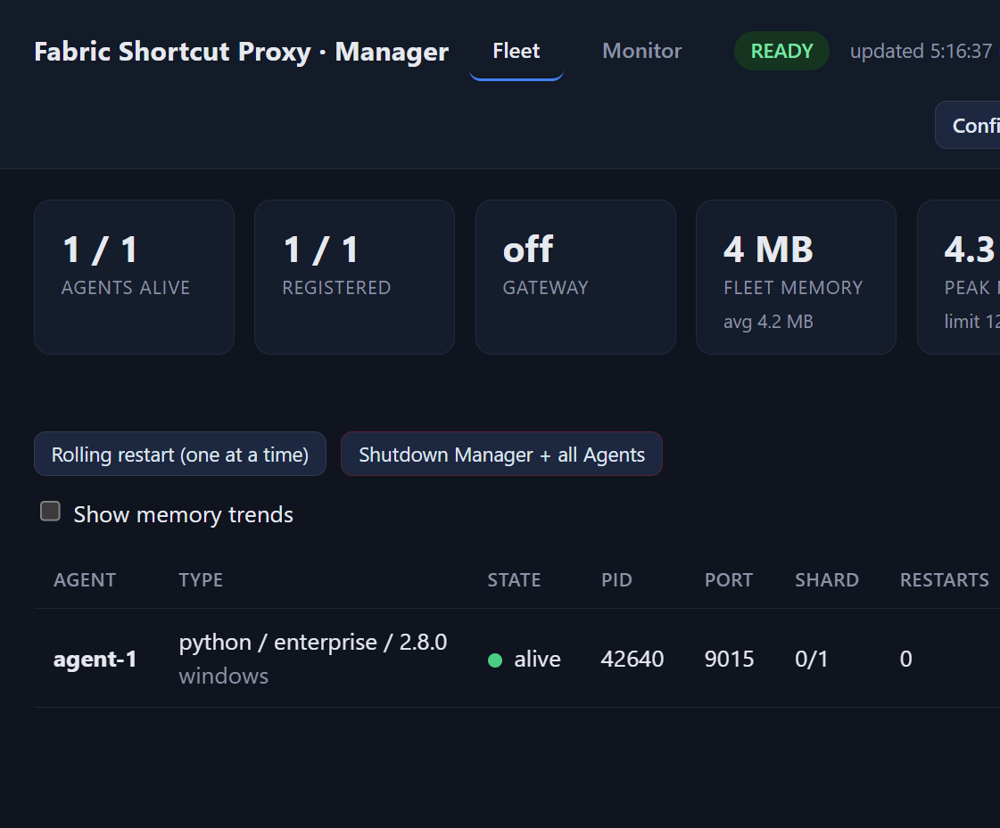
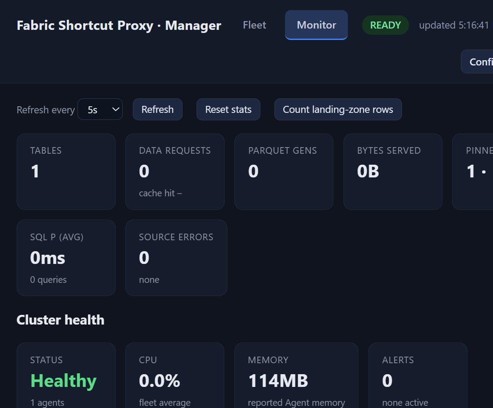
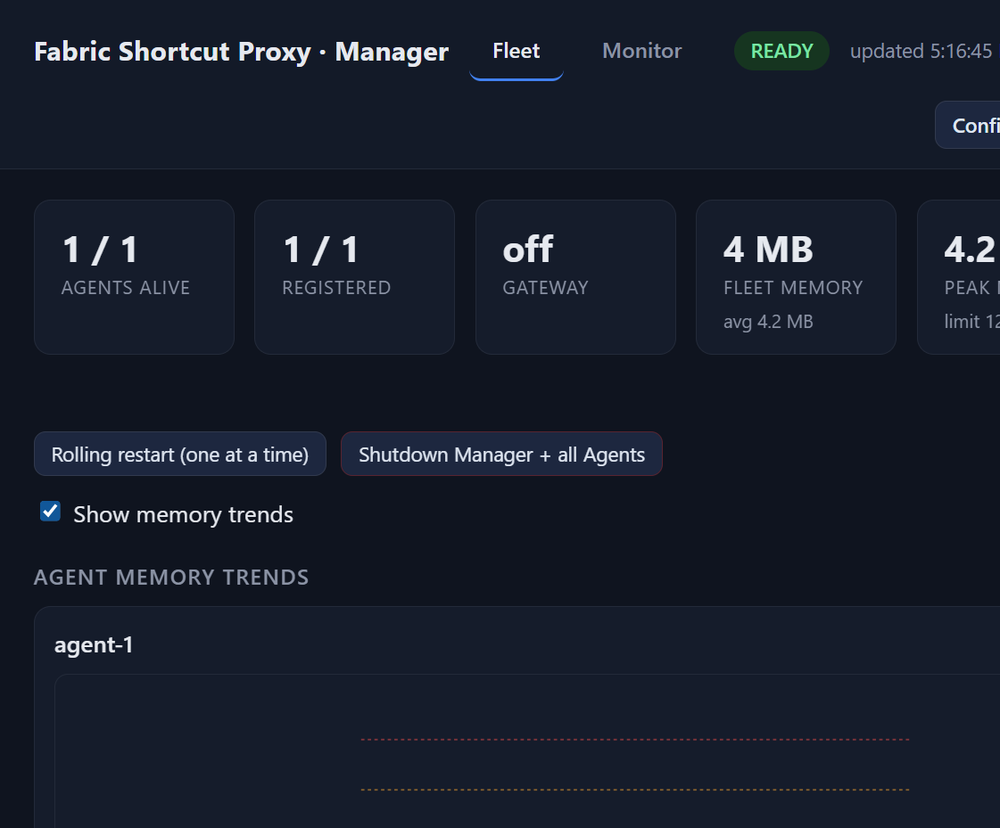

# Manager Guide

The Enterprise Manager supervises Agents, reports fleet health, serves the
operator console, and hosts the Config Builder and Monitor. Start it with
`Manager.ps1` on Windows or `Manager.sh` on Linux/macOS. The control plane uses
port `9200` by default; Agents serve the S3 data plane from port `9000` upward.

Open `/_manager` on the Manager control-plane URL. Configure
`MANAGER_AUTH_ENABLED=1` and a non-empty Manager password before exposing this
surface beyond a local network.

## 1. Read the fleet view

The **Fleet** view shows whether the Manager is ready, the number of live and
registered Agents, gateway state, fleet memory, and each Agent's process state.

Each Agent row lists its port, shard assignment, restart count, heartbeat age,
current and peak memory, and the tables it serves. An Agent is live when the
Manager has an active process and recent heartbeat. A registered external Agent
can be alive even when the Manager did not start its process.

Use the fleet view before changing configuration, restarting an Agent, or
opening the Fabric shortcut. Check that every expected Agent is registered and
that its heartbeat age is near the configured `HEARTBEAT_MS` interval.

## 2. Monitor runtime health

Select **Monitor** to inspect fleet health, table status, request activity, and
operational alerts. The Manager aggregates its own state and Agent heartbeats;
it does not expose database credentials or token keys.

Use Monitor after a deployment, source change, or Open Mirroring publish. A
quarantined table identifies a source or validation failure without taking down
healthy tables. Use the reported error, `/readyz`, and Agent logs to repair the
source before forcing a retry or restart.

## 3. Watch memory trends

Select **Show memory trends** in Fleet to graph the retained memory samples for
each Agent.

`MEMORY_ALERT_THRESHOLD_MB` defaults to `800`; `MEMORY_RESTART_THRESHOLD_MB`
defaults to `1200`. The Manager records `MEMORY_HISTORY_SAMPLES` measurements
per Agent. Investigate sustained growth before an Agent reaches its restart
threshold. For proxy-side Arrow tokenization fallback, begin with one fallback
materialization per Agent and `STREAM_BATCH_ROWS=100000` or lower.

## 4. Control Agents safely

The Manager console presents the following lifecycle actions for each local
Agent:

| Action | Use | Result |
| --- | --- | --- |
| Start | A supervised Agent is stopped | Starts the configured Agent process |
| Stop | Planned maintenance or diagnostics | Stops the Agent; the Manager no longer serves its data-plane port |
| Restart | Apply an Agent-only change or clear a transient failure | Stops and starts the Agent process |
| Drain | Remove an Agent from traffic before maintenance | Returns `503` from its readiness endpoint, waits `AGENT_DRAIN_GRACE_SECONDS`, then exits |
| Forget | Remove a dead external registration | Available only when the Agent no longer has a live heartbeat |

Use **Rolling restart (one at a time)** for a fleet. The Manager waits up to
`ROLLING_RESTART_HEALTH_TIMEOUT` seconds for each Agent to become ready before
moving to the next. Do not use **Shutdown Manager + all Agents** as a routine
configuration apply; it stops every supervised process.

Mutating Manager actions require the configured Manager credential and may also
require the `ADMIN_TOKEN` or a user with the matching function permission.

## 5. Choose supervision and gateway modes

`MANAGER_SUPERVISION_MODE=local` is the default. The Manager starts child Agent
processes and restarts them after transient failures. Use
`MANAGER_SUPERVISION_MODE=external` when Kubernetes, systemd, or another
orchestrator owns Agent lifecycle. External Agents must register with the
Manager and advertise a routable host.

Set `ENABLE_GATEWAY=1` to run the built-in round-robin S3 gateway in front of
the Agent fleet. Point Fabric at the gateway instead of an individual Agent.
For an external load balancer, follow [EXTERNAL_LB_RUNBOOK.md](EXTERNAL_LB_RUNBOOK.md).

In HA mode, one Manager holds the leader lease and supervises the fleet. A
standby remains available for control-plane health but its gateway returns `503`
until it becomes leader and Agents register.

## 6. Use the Config UI

Select **Config UI** to manage sources, tables, Open Mirroring targets,
tokenization policies, credentials, and saved settings. The Manager hosts this
at `/_config`; changes to source URLs, Agent count, ports, TLS, materialization
mode, or Manager authentication require a Manager restart.

See [CONFIG_BUILDER_GUIDE.md](CONFIG_BUILDER_GUIDE.md) for screen-by-screen
configuration instructions. Return to Fleet after an apply or restart and check
that all expected Agents register and serve the correct tables.

## 7. Operational checks

1. Confirm `/_manager` reports every expected Agent as alive and registered.
2. Confirm `/healthz` returns `200`; use `/readyz` to confirm the source and
   table snapshots are ready.
3. Review Monitor for quarantined tables, restart counts, and memory alerts.
4. Before a rolling restart, confirm a second Agent or a maintenance window is
   available for every table.
5. After a source or mirror change, use Config Builder **Check health** before
   publishing and inspect the resulting background job.

For deployment topology and service setup, see [Chapter 8: Operations](manual/08-operations.md)
and [Enterprise_Deployment_guide.md](Enterprise_Deployment_guide.md).
