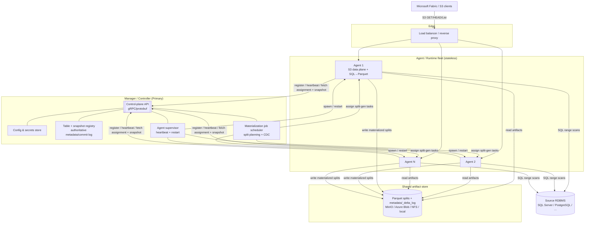

# Scale & Robustness Architecture: Manager / Agent Rewrite

**Status:** Proposal (design). Target: turn the current single-process proxy into a
**Manager/Controller + Agent/Runtime cluster** that serves large SQL datasets
(tables with **hundreds of millions of rows**), runs on **Windows and Linux**, and
is structured so the Agent runtime can later be **rewritten in C++** against a
frozen, language-agnostic contract.

Companion docs: [PLANNING.md](PLANNING.md) (hardening roadmap),
[DELTA_FORMAT.md](DELTA_FORMAT.md), [FRESHNESS_PLAN.md](FRESHNESS_PLAN.md),
[CONFIGURATION.md](CONFIGURATION.md).

---

## 1. Goals & non-goals

### Goals
1. **Split the app into two roles** with a clean network boundary:
   - **Manager/Controller**: the single source of truth for configuration and
     the published table state; orchestrates and supervises Agents.
   - **Agent/Runtime**: stateless worker that speaks the S3 data plane and
     generates/serves Parquet.
2. **Supervision:** the Manager launches one or more Agents, watches their health,
   and **restarts any Agent that crashes**: the Apache Ozone model (a primary
   that orchestrates a fleet of stateless S3 gateways / workers).
3. **Scale:** serve tables of **10⁸+ rows** with bounded memory, index-friendly
   queries, parallel materialization, and incremental refresh.
4. **Cross-platform:** first-class Windows **and** Linux (dev + prod).
5. **Portability:** the Manager↔Agent contract, the on-disk artifact layout, and
   the S3 data plane are **language-agnostic specs** so the Agent can be
   reimplemented in C++ later with no protocol change.
6. **Zero-regression path:** the current single-process mode keeps working
   throughout the migration; the cluster is opt-in.

### Non-goals (for this phase)
- Replacing Fabric's S3-shortcut contract (Iceberg/Delta output stays as is).
- Rewriting the SQL→Parquet logic in C++ *now*, only making it possible later.
- A general query engine. We still push down simple, index-friendly range scans.
- Multi-region / geo-replication (called out as future work).

---

## 2. Where the current design breaks at scale

Grounded in the current code:

| Area | Current behavior | Why it fails at 10⁸ rows |
|---|---|---|
| **Split strategy** | [planner/split_planner.py](../planner/split_planner.py): `WHERE (pk % :num_splits) = :i` | Modulo forces a **full-table scan per split** (can't use the PK index). 8 splits × 100M rows = 8 scans of 100M rows. |
| **Rows per file** | `NUM_SPLITS` fixed (default 8) | 100M / 8 = **12.5M rows/file**: huge Parquet, slow, memory-heavy. |
| **Materialization** | Eager at startup, all splits built and **pinned in RAM** (`PIN_MATERIALIZED_SPLITS`) | Pins every split in memory for the snapshot's life → **OOM** well before 100M rows. |
| **Parquet generation** | [parquet/generator.py](../parquet/generator.py) buffers the full result set, then writes | Buffering 12.5M rows in Arrow arrays per split → memory blow-up. |
| **State** | [iceberg/state_store.py](../iceberg/state_store.py) in-memory dict, one process | No shared/consistent view across workers; lost on restart. |
| **Process model** | Single FastAPI/uvicorn process | One core-bound event loop; a crash takes the whole service down; no horizontal scale. |
| **Refresh** | [iceberg/freshness.py](../iceberg/freshness.py) re-reads & re-hashes **every** chunk each poll | Re-reading 100M rows per poll is infeasible; needs incremental/CDC. |

**Root shift required:** decouple the **write path** (materialize Parquet + publish
metadata, orchestrated by the Manager, parallel, streamed to a shared store) from
the **read path** (stateless Agents proxying bytes from that store). This is how a
real lakehouse gateway (and Ozone) works: *write once, read many, scale the
readers*.

---

## 3. Target architecture



**Mapping to Apache Ozone** (the requested model):

| Ozone | Here |
|---|---|
| Ozone Manager (namespace/keys, Raft-HA) | **Manager**: table registry + authoritative snapshot/commit log |
| Storage Container Manager (block/DataNode lifecycle) | **Manager**: split planning, materialization jobs, Agent lifecycle |
| S3 Gateway (stateless S3 REST, scale-out behind LB) | **Agent/Runtime**: stateless S3 data plane |
| DataNodes (store blocks) | **Shared artifact store**: materialized Parquet + metadata |

---

## 4. Component responsibilities

### 4.1 Manager / Controller (the Primary)
- **Configuration ownership.** Single source of truth: `DB_URL`(s), secrets, the
  `TABLES` registry, per-table `TABLE_FORMAT`, split policy, refresh policy. Agents
  never read local config files, they pull scoped config from the Manager.
- **Authoritative table state.** Owns the **published snapshot/version** per table
  and the canonical metadata artifacts (Iceberg `metadata.json`/manifests or the
  Delta `_delta_log`). Publishing is atomic; Agents serve exactly what the Manager
  has published.
- **Split planning.** Computes the range-based split plan per table (see §7.1).
- **Materialization orchestration.** Schedules split-generation tasks, distributes
  them across Agents (work queue), collects real file sizes, then **publishes** the
  new snapshot only after all referenced files exist in the artifact store.
- **Freshness / CDC.** Runs the single-writer refresh loop (watermark/CDC based),
  producing incremental diffs (ties into the existing Delta diff-commit logic).
- **Supervision.** Registry of Agents; liveness via heartbeats; **restart on
  crash**; rolling restarts for upgrades; drains before shutdown.
- **Admin surface.** Hosts the config-builder and the monitoring dashboard
  (aggregated across Agents), `/readyz` for the cluster, and the control API.

### 4.2 Agent / Runtime (the Worker)
- **S3 data plane only.** `GET`/`HEAD`/`ListObjectsV2`, ranged reads, SigV4, the
  existing [s3/router.py](../s3/router.py) behavior, unchanged on the wire.
- **Stateless.** Holds no authoritative state. On startup it registers with the
  Manager, pulls its assignment + the current published snapshot, and warms local
  caches from the shared store. A restart is cheap and safe.
- **On-demand generation.** For a data key not yet materialized, stream rows from
  the source via a bounded range scan → stream into a Parquet writer → write to the
  shared store → serve. (In the two-phase model this is normally pre-done by a
  materialization task; on-demand is the fallback.)
- **Local read cache.** Hot splits cached on local disk/RAM (bounded, LRU); source
  of truth is the shared store.
- **Health reporting.** Heartbeats + liveness/readiness + metrics to the Manager.

### 4.3 Shared artifact store
- Holds materialized **Parquet splits** and the **metadata/_delta_log** bytes so any
  Agent can serve any object without regenerating.
- Pluggable backend: **local filesystem / NFS / SMB** (single box or shared mount),
  **MinIO / S3**, or **Azure Blob/ADLS**. One small interface: `put(key,bytes)`,
  `get(key[,range])`, `head(key)`, `list(prefix)`, `delete(key)`.
- Content-addressed keys (already used) make writes idempotent and dedup-friendly.

### 4.4 Load balancer
- Any L7 proxy (nginx/HAProxy/Envoy/Azure LB). Round-robins S3 requests across
  Agents. Agents are interchangeable, so no sticky sessions are required (optional
  affinity by key-prefix to improve cache hit rates, see §7.5).

---

## 5. Control-plane contract (Manager ↔ Agent)

Use **gRPC + Protocol Buffers** for the control plane. Rationale: cross-platform,
cross-language (first-class **C++** and Python), schema-evolvable, supports
server-streaming for task dispatch and heartbeats. (A REST/JSON fallback can mirror
it for debugging.) The `.proto` is the **frozen contract** the future C++ Agent
implements.

```proto
syntax = "proto3";
package s3proxy.control.v1;

// ---- Agent lifecycle ------------------------------------------------
service ControlPlane {
  rpc Register(RegisterRequest) returns (RegisterResponse);
  rpc Heartbeat(stream HeartbeatRequest) returns (stream ControlCommand);
  rpc GetAssignment(AssignmentRequest) returns (Assignment);
  rpc GetSnapshot(SnapshotRequest) returns (SnapshotManifest);
  rpc ReportTaskResult(TaskResult) returns (Ack);
}

message RegisterRequest {
  string agent_id = 1;          // stable per instance
  string host = 2; int32 port = 3;
  string os = 4;                // "windows" | "linux"
  string version = 5;           // build/git sha
  int64  capacity_hint = 6;     // cores / mem for scheduling
}
message RegisterResponse { string lease_id = 1; int32 heartbeat_ms = 2; }

message HeartbeatRequest {
  string agent_id = 1; string lease_id = 2;
  AgentHealth health = 3;       // cpu, mem, cache occupancy, inflight
  repeated string serving_tables = 4;
  int64 current_snapshot_epoch = 5;   // which published version it serves
}

// Manager -> Agent pushes (drain, refresh-now, reload-config, materialize task)
message ControlCommand {
  oneof cmd {
    ReloadConfig reload = 1;
    Drain drain = 2;
    MaterializeTask materialize = 3;   // work-queue dispatch
    PublishSnapshot publish = 4;       // switch to new epoch
  }
}

// ---- Table state ----------------------------------------------------
message SnapshotManifest {
  string table = 1;
  int64  epoch = 2;             // monotonic published version
  string table_format = 3;      // "iceberg" | "delta"
  repeated SplitRef splits = 4; // net-current file set
  bytes  metadata_blob = 5;     // metadata.json OR _delta_log commit(s) ref
}
message SplitRef {
  string object_key = 1;        // key in the artifact store
  int64  size_bytes = 2;        // REAL size (post-materialization)
  int64  record_count = 3;
  string content_hash = 4;      // 12-hex, content-addressed
  KeyRange range = 5;           // [lo, hi) on the split key
}
message KeyRange { int64 lo = 1; int64 hi = 2; }   // or bytes for non-int keys

// ---- Materialization work queue ------------------------------------
message MaterializeTask {
  string table = 1; int64 epoch = 2;
  int32  split_index = 3; KeyRange range = 4;
  string source_table = 5; repeated Column schema = 6;
  string output_key = 7;        // where to write in the artifact store
}
message TaskResult {
  string agent_id = 1; string table = 2; int64 epoch = 3; int32 split_index = 4;
  bool ok = 5; int64 size_bytes = 6; int64 record_count = 7;
  string content_hash = 8; string error = 9;
}
```

**Key contract invariants**
- **Epoch = published version.** Agents report the epoch they serve; the Manager
  never publishes an epoch until every `SplitRef` is confirmed present with a real
  `size_bytes`. This is what eliminates the "declared size ≠ served size" class of
  bugs at scale.
- **Retention.** Prior epochs' files stay in the store for a retention window so a
  lagging Agent / stale Fabric reader never 404s (mirrors the fix already shipped
  for the single-process Delta path).

---

## 6. Data plane (unchanged on the wire)

The Agent's S3 surface stays byte-for-byte what Fabric already accepts:
`ListObjectsV2`, `HEAD`, ranged `GET` (incl. suffix ranges for Parquet footers),
SigV4, and the Iceberg **or** Delta object layout. The only change is *where the
bytes come from*: the shared artifact store (or on-demand generation) instead of an
in-process pin. Because the protocol is untouched, **the C++ Agent only has to
implement HTTP + the artifact-store client + the SQL→Parquet path**: all already
specified.

---

## 7. Scaling to 10⁸+ rows

### 7.1 Range-based split planning (replaces modulo)
- Plan a table as **contiguous key ranges** sized to a target row count
  (`TARGET_ROWS_PER_SPLIT`, e.g. 1–2M): `WHERE key >= :lo AND key < :hi`.
- Queries become **index range scans** (seek + sequential), not full scans.
- Split count is derived: `ceil(total_rows / target)`. 100M rows @ 1M = **100
  splits** of ~1M rows (~30–60 MB Parquet each), cacheable, parallelizable.
- Bounds come from cheap catalog stats: `MIN(key)/MAX(key)`, `COUNT(*)`
  (or `reltuples`/`sys.dm_db_partition_stats`), and optional histogram/NTILE for
  skew. Non-integer keys: hash-to-int bucketing or ordered key ranges.
- Backwards compatible: modulo stays available for tiny tables / demo.

### 7.2 Streaming Parquet generation (bounded memory)
- Replace "buffer whole result → write" with a **server-side cursor** streamed in
  batches into an incremental Parquet writer (row groups of N rows), flushing to
  the artifact store. Peak memory ≈ one row group, independent of table size.
- Enables a single Agent to materialize a 1M-row split in constant memory, and to
  serve 10⁸-row tables without ever holding a whole split in RAM.

### 7.3 Two-phase publish (materialize → then advertise)
1. **Materialize:** the Manager schedules split-gen tasks; Agents stream each range
   to the store and report real `size_bytes` + `content_hash`.
2. **Publish:** once all splits for the epoch exist, the Manager writes the
   metadata/`_delta_log` and bumps the epoch atomically. Agents flip to the new
   epoch on the next heartbeat/command.
- Serving reads are then pure proxying of durable bytes → **no size drift**, no
  regeneration races, predictable latency. (Generalizes the current pinning +
  content-addressing to a shared store.)

### 7.4 Distributed, parallel materialization
- Split-gen is embarrassingly parallel. The Manager fans `MaterializeTask`s across
  the Agent fleet (bounded by each Agent's `capacity_hint` and a global concurrency
  cap to protect the source DB). 100 splits across 10 Agents = ~10 each.
- Failed tasks are retried on another Agent (idempotent, content-addressed output).

### 7.5 Read scale & cache affinity
- N Agents behind the LB serve reads concurrently. Optional **key-prefix affinity**
  (hash the object key → Agent) improves local cache hit rates without shared
  caching. The shared store is the safety net for any miss.

### 7.6 Incremental / CDC refresh (don't re-read 10⁸ rows)
- Detect change per split range, not per table:
  - **Watermark column** (`updated_at`, `rowversion`, `xmin`) → only re-materialize
    ranges whose max watermark advanced.
  - **DB CDC** (SQL Server Change Tracking/CDC, Postgres logical/`xmin`) where
    available → exact changed-key sets → touch only affected split ranges.
- Content-addressing means unchanged ranges keep their key; the epoch's commit is a
  **diff** (add changed ranges, remove replaced ones), exactly the Delta
  diff-commit already implemented, now at range granularity.
- Result: a refresh cost proportional to **changed data**, not table size.

### 7.7 Backpressure & protection
- Global + per-source concurrency semaphores (extend `MAX_CONCURRENT_GENERATIONS`
  to the cluster via the Manager's scheduler).
- Query timeouts, row caps, and circuit breakers on the source DB; shed load with
  `503 + Retry-After` (already present) when saturated.

### Appendix capacity sketch (100M-row table)
- 100 splits × ~1M rows. Parquet ≈ 30–60 MB/split → ~3–6 GB total in the store.
- Cold full materialize: 100 tasks; at 10 Agents × 4 concurrent = 40-wide, a few
  minutes bounded by source read throughput.
- Steady state: Agents serve from the store/cache; RAM per Agent bounded by cache
  size, **not** table size. Incremental refresh touches only changed ranges.

---

## 8. State, consistency & snapshot lifecycle

- **Authoritative registry in the Manager**, persisted to a durable embedded store
  (SQLite/RocksDB) or Postgres: tables, per-table current **epoch**, split refs,
  retained epochs, Agent leases.
- **Atomic publish:** readers only ever see a fully-materialized epoch. Epoch flip
  is a single registry write; Agents converge within one heartbeat.
- **Retention window:** keep the last K epochs' files (bounded, like
  `SNAPSHOT_HISTORY_LIMIT`) so lagging readers don't 404 during a flip. Background
  GC deletes files no live epoch references after the window.
- **Consistency model:** eventually-consistent reads across the fleet within one
  heartbeat interval; each individual read is snapshot-consistent (serves one
  epoch's net file set). Good enough for Fabric's periodic sync.
- **Manager restart:** state is durable → fast recovery; in-flight materialization
  tasks are re-derived and re-dispatched (idempotent).

---

## 9. Supervision, health & crash recovery

- **Registration + lease:** each Agent registers and holds a lease refreshed by
  heartbeat. Missed heartbeats (N intervals) ⇒ Manager marks the Agent dead.
- **Restart on crash:** the Manager (or the OS service manager it drives)
  **respawns** the Agent; the fresh Agent re-registers, pulls assignment + epoch,
  warms cache, rejoins the LB pool. Because Agents are stateless, no data is lost.
- **Liveness vs readiness:** liveness = process/event-loop alive; readiness = epoch
  loaded + artifact store reachable + (optionally) source reachable. LB routes only
  to *ready* Agents.
- **Rolling upgrades:** drain → wait for inflight to finish → stop → start new →
  ready → next Agent. No downtime.
- **Manager HA (later):** replicate the registry via **Raft** (analogous to Ozone's
  Ratis) for multi-Manager failover. v1 ships a single Manager with durable state +
  fast restart + a standby that can take over the durable store.

---

## 10. Cross-platform (Windows + Linux) & future C++ portability

- **Process supervision abstraction** with OS backends:
  - *Direct-spawn backend* (default, both OSes): Manager spawns Agents as child
    processes; on Linux uses process groups, on Windows uses **Job Objects** so
    children die with the Manager; supervise + restart in-process.
  - *Service backend:* Linux **systemd** units / Windows **Services** manage Agent
    lifecycle; the Manager coordinates via the control API.
  - *Container backend:* Kubernetes `Deployment` (Agents) + `StatefulSet`
    (Manager); K8s does the restarts, the Manager does assignment. Same contract.
- **No language-specific IPC.** Everything crosses the boundary as **gRPC/protobuf**
  (control) + **HTTP/S3** (data) + **artifact-store bytes** (Parquet + metadata).
  No pickle, no shared memory, no OS-specific RPC.
- **Frozen specs for the C++ rewrite:**
  1. the `.proto` control contract (§5),
  2. the S3 data-plane behavior (§6, already spec-compliant),
  3. the artifact-store key layout + Parquet/field-id + Iceberg/Delta byte formats
     (documented in [DELTA_FORMAT.md](DELTA_FORMAT.md) and the repo notes).
  A C++ Agent implements HTTP + an artifact-store client + Arrow/Parquet C++ + an
  ODBC/libpq SQL client, **nothing in the contract is Python-specific.**
- Path/line-ending/temp-file handling kept OS-neutral (atomic writes via
  temp-file + rename already used).

---

## 11. Deployment topologies

| Topology | Layout | When |
|---|---|---|
| **Single box** | 1 Manager + N Agents as child processes; artifact store = local dir | Dev, small prod, current-parity |
| **Multi-node** | Manager on one host; Agents on several; artifact store = NFS/SMB or MinIO; LB in front | Scale reads + materialization |
| **Containers/K8s** | Manager `StatefulSet` + Agent `Deployment` (HPA); Blob/S3 store; Service/Ingress LB | Cloud, elastic scale |
| **Hybrid Windows/Linux** | Manager on either; Agents on both (mixed fleet) | Enterprise heterogeneity |

Single-box mode is the **compatibility bridge**: it behaves like today's server but
with the Manager/Agent split internal, so nothing about the Fabric setup changes.

---

## 12. Security

- **Secrets stay in the Manager.** Agents receive only what they need, ideally as
  **short-lived scoped tokens/connection handles**, not raw DB passwords; support
  Key Vault / env-injection for the Manager's own secrets.
- **mTLS on the control plane** (gRPC): Manager and Agents authenticate each other;
  rotate certs (Ozone-style internal CA optional).
- **Data plane:** keep SigV4 (`REQUIRE_SIGV4`) between Fabric and the LB/Agents.
- **Network segmentation:** control plane and artifact store on a private network;
  only the LB's S3 port is exposed.
- **Least privilege** DB accounts (read-only), per-table where possible.

---

## 13. Observability at cluster scale

- Agents export the existing metrics/trace/querystats; the **Manager aggregates**
  them into a cluster view.
- The **monitor dashboard** moves behind the Manager and shows: fleet health, per-
  Agent load/cache, per-table epoch + materialization progress, output **format**
  (iceberg/delta, already added), and end-to-end query lag.
- Cluster `/readyz` = Manager ready **and** ≥1 ready Agent per assigned table.
- Distributed tracing: propagate a request/epoch id from LB → Agent → source so a
  slow Fabric read can be traced across the fleet.

---

## 14. Phased migration (keep single-process working throughout)

Each phase is shippable and reversible; the default stays the known-good path.

- **Phase 0, Seams (refactor, no behavior change).**  ✅ **DONE**
  Carve the codebase into `runtime/` (S3 router, generator, cache, artifact-store
  interface) and `control/` (config ownership, registry, snapshot lifecycle) with
  the artifact store behind an interface (local-dir impl first). Freeze the
  Manager↔Agent `.proto`.
  - **Delivered:**
    - `runtime/` package + `runtime/artifact_store.py`: `ArtifactStore` interface
      with `LocalDirStore` (atomic temp-file+rename, path-traversal-safe) and
      `MemoryStore`, a `build_store` factory, and a process-default singleton.
    - `control/` package + `control/contract.py`: the frozen contract as
      transport-neutral dataclasses + dict/JSON codec (usable now over REST or
      protobuf later), and **`control/proto/control.proto`**: the frozen gRPC
      form, mirrored 1:1.
    - `config.py`: `ARTIFACT_STORE_BACKEND` / `ARTIFACT_STORE_DIR` settings
      (+ validation, catalog category "Cluster (scale)").
    - Tests: `tests/test_artifact_store.py`, `tests/test_control_contract.py`.
  - **Deliberately deferred (risk):** *physically relocating* existing modules
    (`s3`, `parquet`, `cache`) into `runtime/` is NOT done, a big-bang package
    move would churn every import and risk the green suite. The seam is enforced
    for **new** code (artifact store lives in `runtime/`); existing modules migrate
    incrementally in later phases. The artifact store is introduced but **not yet
    on the hot serving path** (that is Phase 2).
  - *Exit:* ✅ **166 tests green** (135 + 31 new); single process unchanged.

- **Phase 1, Manager supervises one local Agent.**  ✅ **DONE**
  Introduce the Manager process; it owns config, spawns a single Agent child,
  tracks it via **heartbeats over the REST control plane** (open decision #1,
  resolved REST-first), and **restarts it on crash**. The S3 data plane is
  unchanged; an Agent with no `MANAGER_URL` behaves exactly like today, the
  control link is additive/opt-in.

  **Transport seam** (so gRPC can slot in later without touching callers):
  ```text
  control/transport.py
    ControlServer (protocol)   register / heartbeat / get_assignment /
                               get_snapshot / report_task_result
    ControlClient (abstract)   async register / heartbeat / get_assignment / ...
    RestControlClient          httpx impl (Agent side)
    create_control_router()    adapts a ControlServer to FastAPI routes (Manager)
  control/registry.py     agent leases + heartbeat freshness + dead detection
  control/server.py       ControlService: ControlServer over the registry
  control/supervisor.py   spawn / watch (process exit + heartbeat) / restart+backoff
  control/manager_app.py  control FastAPI app + supervisor lifespan   (manager.py)
  runtime/agent_link.py   Agent's register+heartbeat loop; handles the drain command
  ```
  A future `GrpcControlClient` + gRPC server implement the same two interfaces.
  *Exit:* ✅ kill an Agent → Manager restarts it (`restart_count` bumps, the fresh
  Agent re-registers and serves S3 again); a standalone Agent (no `MANAGER_URL`) is
  byte-identical to today. **176 tests green** (166 + 10); live-verified end-to-end
  (Manager spawns Agent → kill Agent → auto-restart → re-serve; Manager shutdown
  terminates the child).

- **Phase 2, Shared artifact store + two-phase publish.**  ✅ **DONE (local dir)**
  Move materialized Parquet + metadata to the store; Agent serves from it; Manager
  publishes epochs atomically. Agents become stateless.
  - **Delivered:** `ARTIFACT_STORE_SERVING` (default off; **Manager enables it for
    supervised Agents**) makes the artifact store the durable serving tier,     `cache.lru_cache` write-throughs materialized splits to the store and
    read-throughs on a cold miss (`get`/`peek`/`warm_parquet`), so a restarted or
    stateless Agent serves **byte-identically from the store with zero SQL
    regeneration**. Backend defaults to the **local dir** (`ARTIFACT_STORE_DIR`).
  - **Backlog (future optional backends):** Azure **Blob/ADLS**, **MinIO/S3**, and
    NFS/SMB shared mounts, same `ArtifactStore` interface, no serving-code change.
    Also deferred: writing the *metadata*/`_delta_log` bytes to the store (they're
    deterministic and cheap to rebuild from the registry today).
  - **Correctness note:** within a published epoch the store is authoritative for a
    key; changed data must yield a new key (content-addressed freshness) or a full
    rebuild that overwrites the store.
  - *Exit:* ✅ **184 tests green** (176 + 8). Live-verified: materialize populated
    `.artifacts/` (8 splits); after a kill+restart the Agent logged
    `splits_materialized` with **zero `sql_execute` / `parquet_generated`** and
    served a byte-identical data file (200, 166566 bytes).

- **Phase 3, N Agents + LB + distributed materialization.**  ✅ **DONE**
  Multiple Agents behind an LB; Manager fans materialization tasks across them.
  - **Delivered:** the Manager supervises **`AGENT_COUNT`** Agents (each on `PORT+i`,
    its own materialization shard) and, when **`ENABLE_GATEWAY`** is set, fronts them
    with a built-in round-robin S3 gateway ([control/gateway.py](../control/gateway.py))
    that reverse-proxies GET/HEAD/List to the **live** Agents (range-aware, streaming;
    dead Agents excluded). **Distributed cold materialization**: each Agent owns
    `split_index % AGENT_SHARD_COUNT == AGENT_SHARD_INDEX`; a non-owner waits for the
    owner to publish the split to the shared store (polling outside the generation
    semaphore, `MATERIALIZE_WAIT_SECONDS`), so each split is generated **once** across
    the fleet and all Agents serve everything from the store. `Manager.ps1` gains
    `-AgentCount` / `-Gateway`. Defaults (`AGENT_COUNT=1`, gateway off) keep the
    single-Agent path unchanged.
  - **Backlog:** multi-node `AGENT_ADVERTISE_HOST` (the gateway currently maps
    `0.0.0.0`→loopback for single-box); sharding the freshness (AUTO_REFRESH) path;
    an external L7 LB (nginx/HAProxy/Envoy) as an alternative to the built-in gateway.
  - *Exit:* ✅ **190 tests green** (184 + 6). Live-verified (2 Agents + gateway):
    both registered (`/readyz` 2/2), the gateway served the list + data via the fleet,
    each split generated **exactly once** across the two Agents (≈4+4, no redundant
    SQL), and killing an Agent bumped its `restart_count` while the gateway kept
    serving `200`.

- **Phase 4, Scale engine (the 10⁸-row target) + operator console.**  ✅ **DONE**
  Range-based split planning (§7.1), streaming Parquet (§7.2), incremental/CDC
  refresh (§7.6), cluster backpressure.
  - **`/_manager` operator console.**  ✅ **DONE**: a built-in, self-contained
    admin page ([control/admin.py](../control/admin.py)) served by the Manager at
    **`/_manager`** (gated behind `ENABLE_ADMIN_UI`, off by default), plus a small
    JSON admin API that backs it and is scriptable:
    - **Monitor:** `GET /_manager/api/fleet` merges per-Agent **supervisor** state
      (pid, process alive, `restart_count`, crash-loop, port, shard) with the
      **registry** view (registered?, heartbeat age, serving tables/epochs,
      pending commands) and rolls up ready/alive/registered + gateway target count.
      The page auto-refreshes on a 2 s poll.
    - **Control:** `POST /_manager/api/agents/{name}/{start|stop|restart|drain}`,       start/stop/restart act through the existing `AgentSupervisor` (process control);
      **drain** queues a `Drain` control command (graceful recycle on the Agent's
      next heartbeat). Mounted **before** the gateway catch-all; mutating actions are
      guarded by `ADMIN_TOKEN` (`X-Admin-Token` header or `?token=`) when set, reads
      stay open. `Manager.ps1` gains `-AdminUi` / `-AdminToken`. The gateway reserves
      the Manager namespace and an Agent redirects `/_manager` → the Manager console
      (via `MANAGER_URL`) so either port lands on the console instead of a SigV4 403.
  - **Range-based split planning (§7.1).**  ✅, `SPLIT_STRATEGY="range"` (default
    `modulo`) slices `[MIN(pk), MAX(pk)]` into contiguous half-open key ranges
    ([planner/split_planner.py](../planner/split_planner.py) `compute_key_ranges`) so
    each split runs `WHERE pk >= lo AND pk < hi` off the **PK index** instead of a
    full-table modulo scan, the shape that scales to 10⁸ rows. Planned once at
    startup from a single `MIN/MAX` probe (`db.executor.fetch_key_bounds`); falls
    back to modulo on an empty/non-integer key.
  - **Streaming Parquet (§7.2).**  ✅, `STREAMING_PARQUET=1` reads a split in
    `STREAM_BATCH_ROWS` batches (`db.executor.stream_split_query`) and writes them
    incrementally through one `ParquetWriter`
    ([parquet/generator.py](../parquet/generator.py) `stream_rows_to_parquet`), so peak
    *input* memory is ~one batch instead of the whole split.
  - **Cluster backpressure.**  ✅, `SOURCE_MAX_CONCURRENCY` caps concurrent source
    queries per Agent (startup **and** on-demand regeneration) via a shared gate in
    `db.executor`; 0 = unlimited. Fleet load ≈ agents × cap.
  - **Backlog:** equal-*count* (NTILE) range planning for skewed keys; range/streaming
    on the AUTO_REFRESH path; a **global cross-Agent** source limiter (v1 is per-Agent);
    true CDC/incremental refresh (refresh cost ∝ change).
  - *Exit:* ✅ **219 tests green** (203 + 9 range + 7 streaming/backpressure).
    Live-verified (range + streaming + backpressure, 8 splits over 50 000 rows):
    `range_planning_ok` sliced `[1,50000]` into contiguous `pk` ranges, each split
    `parquet_streamed` its 6 250 rows, and the S3 API served **all 50 000 rows with
    complete id coverage (1..50000, no dupes/gaps)**. Defaults (`modulo`,
    non-streaming, unlimited) keep the known-good path byte-identical.

- **Phase 5, Robustness & Manager HA.**  ✅ **DONE**
  Durable registry, rolling upgrades, retention GC, then Raft-replicated Manager.
  - **Leader lease / Manager failover.**  ✅, `MANAGER_HA=1` runs a TTL leader
    lease over the shared artifact store ([control/lease.py](../control/lease.py)):
    only the **primary** supervises Agents + serves the gateway; **standbys** stay
    passive and take over when the primary stops renewing (`/healthz` reports
    `is_leader`, `/readyz` reports `primary`/`standby`). Best-effort read-check-
    write-verify election (a brief dual-holder window at expiry is tolerable,     Agents serve reads regardless; strict single-writer election / Raft is backlog).
  - **Rolling upgrade.**  ✅, `POST /_manager/api/rolling-restart` (console button)
    recycles Agents **one at a time**, health-gated ([control/rolling.py](../control/rolling.py)):
    it deregisters each Agent from the registry *before* stopping it so the gateway
    drops it from rotation instantly, then waits for it to re-register before the
    next, so >= N-1 keep serving with **no read gap**.
  - **Retention GC.**  ✅, an Agent (shard 0) periodically prunes orphaned Parquet
    splits (from snapshot versions aged out of history) from the shared store
    ([runtime/retention.py](../runtime/retention.py)); `RETENTION_GC` + interval, plus
    a manual `POST /_admin/gc` (`?dry_run=true`). Conservative: only `.../data/*.parquet`.
  - **Backlog:** strict single-writer election (Raft/etcd) to close the lease race
    window; a shared **floating address / external LB** so failover keeps the same
    read endpoint (v1 standby serves on its own ports); orphaned-child cleanup on a
    hard primary crash; metadata GC; durable registry snapshot for instant warm view.
  - *Exit:* ✅ **230 tests green** (219 + 11 in
    [tests/test_phase5_ha.py](../tests/test_phase5_ha.py)). Live-verified: **rolling
    restart** kept the gateway at **30/30** reads while both Agents recycled (new
    pids); **retention GC** pruned an orphan (9→8) and kept the 8 live splits
    (dry-run first); **Manager failover**: a standby stayed passive
    (`is_leader=false`, 0 Agents) while the primary held the lease, then on primary
    loss acquired the lease, `ha_became_primary`, spawned its Agents, and its gateway
    served 8 keys. Defaults (`MANAGER_HA`/`RETENTION_GC` off) keep single-Manager
    behavior unchanged.

- **Phase 5.1, Live config: read current config + push changes (incl. fleet size).**
  Turn the config builder (`/_config`) from a *download-a-config.json* generator into a
  live control surface that **reads the running configuration** and **pushes changes
  back to the server**: most notably the **number of Agents**.
  - **Read effective config:** `GET /_config/api/current` reports every setting's
    **current effective value** and its **source** (env var / `config.json` / built-in
    default), secrets redacted. The builder loads this so an operator sees what's
    actually running, not just defaults.
  - **Push config:** `POST /_config/api/save` validates + type-coerces a partial
    settings map, **merges** it into the on-disk `config.json` (preserving `tables`
    and unlisted keys) with an atomic write, and reports the changed keys + a
    `restart_required` note (config is import-time, so persisted changes apply on the
    next start, except fleet size, below). Unknown keys and bad types are rejected.
  - **Live fleet scaling:** `POST /_manager/api/scale {count}` grows/shrinks the
    supervised Agent fleet **at runtime**: the Manager adds supervisors (new ports,
    served from the shared store, no cold regeneration) or stops + deregisters extras
    (so the gateway drops them from rotation immediately), and **persists**
    `agent_count` to `config.json`. This is the "push number of agents" path applied
    without a Manager restart.
  - **Reachability:** the config builder is mounted on **both** the Agent and the
    **Manager** (gated by `ENABLE_CONFIG_BUILDER`); on the Manager it's reserved from
    the gateway catch-all (like `/_manager`) and can drive `/_manager/api/scale`. The
    UI gains a "Live server config" card: load current → edit → **Save**, plus a
    **fleet-size** control (Apply) that scales live when served by the Manager.
  - **Security:** mutating actions honor the Manager's `ADMIN_TOKEN`; the builder
    still warns it's an admin tool (accepts credentials) and should be run locally.
  - *Exit:* the config builder reads live config, saves changes to `config.json`, and
    scales the Agent fleet up/down live from the browser (or the JSON API).

- **Phase 6, C++ Agent.**  ✅ **DONE (serving Agent)**
  Reimplement the Agent runtime in C++ against the frozen `.proto` + S3 + artifact
  formats. Runs interchangeably in the same fleet (mixed Python/C++ Agents during
  rollout).
  - **Enabler, complete serving image (Python).** `PUBLISH_SERVING_IMAGE` writes a
    fully self-contained table image to the artifact store: every S3 object the
    Agent serves, data splits **and** the Iceberg `metadata.json`/manifests/
    `version-hint.text` (or Delta `_delta_log`), keyed by its exact S3 key
    ([runtime/serving_image.py](../runtime/serving_image.py); `POST /_admin/publish-image`).
    The store dir becomes a valid, servable warehouse.
  - **C++ serving Agent** ([agent-cpp/agent.cpp](../agent-cpp/agent.cpp), no third-party
    deps; build via [agent-cpp/build.ps1](../agent-cpp/build.ps1) on Windows and
    [agent-cpp/build.sh](../agent-cpp/build.sh) on Linux):
    serves the S3 data plane, `GET`/`HEAD` with **Range** (explicit + suffix/footer),
    `ListObjectsV2`, `/healthz`, by returning objects **verbatim from the store**
    (no SQL/Parquet/Iceberg logic of its own), and optionally **registers +
    heartbeats** to the Manager's REST control plane (`/control/register`,
    `/control/heartbeat`) so it joins the fleet behind the gateway.
  - **Portability hardening (complete):** socket layer abstracted behind a platform
    shim with both Win32 and POSIX backends; canonical path-under-root checks;
    non-throwing parse paths; streamed GET/Range + HEAD stat fast-path; Linux CI
    conformance parity job builds the C++ agent, publishes a serving image with the
    Python publisher, and validates `pyiceberg` against the Linux C++ endpoint.
  - **Backlog:** a C++ *materializing* Agent (SQL→Parquet→metadata) via Arrow/gRPC;
    multi-node/Linux packaging polish (systemd/container images); Delta image already
    flows through the same publisher.
  - *Exit:* ✅ **244 tests green** (242 + 2). Live-verified: a Python Agent
    materialized + published the 12-object image; the compiled C++ Agent served it
    and **pyiceberg scanned all 50 000 rows** (standalone), served a data split
    **byte-identical** to the Python Agent (SHA-256 match, 166 532 bytes) with
    working Range; and in a **mixed fleet** it registered to the Manager
    (`/agents` shows `agent-1` Python + `cpp-agent-1` C++) and **pyiceberg read the
    whole table through the gateway** round-robining both.

---

## 15. Risks & mitigations

| Risk | Mitigation |
|---|---|
| Manager is a SPOF | Durable state + fast restart (v1); Raft HA (Phase 5). Agents keep serving the last epoch if the Manager is briefly down. |
| Source DB overload from parallel materialization | Global + per-source concurrency caps in the scheduler; off-peak scheduling; read replicas. |
| Artifact store becomes a bottleneck | Local Agent caches + prefix affinity; scale the store (MinIO/Blob) independently. |
| Skewed key distribution → uneven splits | Histogram/NTILE-based range planning; per-split row caps. |
| Non-integer / composite keys | Ordered key ranges or hash bucketing; documented per-table key policy. |
| Consistency confusion during epoch flip | Atomic publish + retention window so old files stay readable until all readers advance. |
| Scope creep vs current working POC | Every phase gated behind flags; single-process mode stays default until parity proven. |

---

## 16. Open decisions

1. **Control transport:** ✅ **RESOLVED (2026-07-25), REST/JSON first, gRPC-ready,
   swap at Phase 5–6.** Ship a REST transport now: it reuses the existing
   FastAPI/httpx stack (zero new binary deps), is curl-debuggable, and uses an
   **Agent-pull** model (the Agent posts heartbeats and receives queued commands in
   the response) so command latency ≤ one heartbeat interval, fine for
   drain/reload/publish, none of which are time-critical. The protobuf contract
   stays frozen; gRPC (bidi push + generated C++ stubs) is introduced at Phase 5
   (HA/higher fleet chatter) or Phase 6 (C++ Agent). The transport hides behind a
   `ControlClient` / `ControlServer` seam (see Phase 1) so the later swap is a
   localized adapter, not a rewrite; `grpcio` stays an optional extra.
2. **Artifact store default:** ✅ **RESOLVED (2026-07-25), local dir now.** Phase 2
   ships the **local-dir** backend as the default serving store (`ARTIFACT_STORE_DIR`).
   Azure **Blob/ADLS**, **MinIO/S3**, and NFS/SMB are in the backlog behind the same
   `ArtifactStore` interface (no serving-code change when added).
3. **Manager state store:** SQLite/RocksDB embedded vs external Postgres.
4. **Supervision default:** in-process direct-spawn vs delegating to
   systemd/Windows Service/K8s from day one.
5. **Split-key policy** for tables without a clean integer PK (hash bucket vs
   ordered range on a chosen column).
6. **CDC sources** to support first (SQL Server Change Tracking vs Postgres
   logical) vs watermark-only.

---

### TL;DR
Split into a **Manager** (owns config + published table epochs, plans & orchestrates
materialization, supervises/restarts Agents) and stateless **Agents** (speak S3,
stream SQL→Parquet, serve from a shared artifact store), the Ozone gateway model.
Scale to 10⁸+ rows via **range-based splits + streaming Parquet + two-phase
publish + distributed materialization + CDC-incremental refresh**, all bounded in
memory. Keep the boundary **gRPC/protobuf + S3 + artifact bytes** so it runs on
Windows and Linux today and the Agent can be rebuilt in **C++** later with no
protocol change. Migrate in reversible phases with the current single-process mode
as the always-green fallback.
