# Technical Architecture

Detailed architecture for the Fabric Shortcut Proxy. The first diagram is the
high-level view (as in [README.md](../README.md)); the sections that follow drill
into each process with its granular components and control/data flow. Every
diagram is grounded in the actual modules referenced beneath it.

> Companion docs: [README.md](../README.md) (setup), [CONFIGURATION.md](CONFIGURATION.md)
> (settings), [SECURITY.md](SECURITY.md) (auth/TLS/audit),
> [SCALE_ARCHITECTURE_PLAN.md](SCALE_ARCHITECTURE_PLAN.md) (fleet),
> [DELTA_FORMAT.md](DELTA_FORMAT.md) (Delta output).

---

## 1. High-level architecture

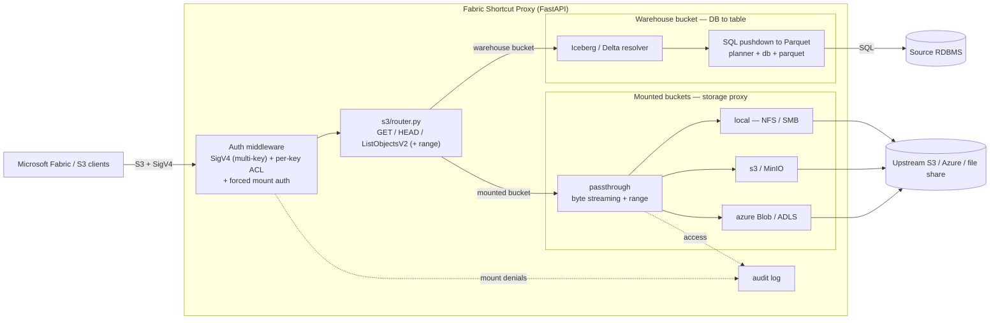

**Two serving modes, one S3 front door.** A bucket with **no mount** resolves
through the DB→Iceberg/Delta path; a bucket **with a mount** streams bytes from a
storage backend. Both share the same SigV4 auth + audit seam.

---

## 2. Package / module map

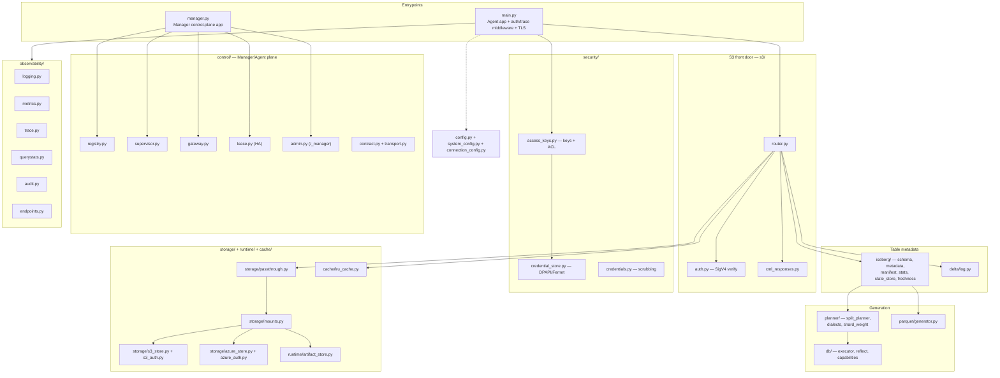

Referenced: [s3/router.py](../s3/router.py), [security/access_keys.py](../security/access_keys.py),
[iceberg/state_store.py](../iceberg/state_store.py), [storage/mounts.py](../storage/mounts.py),
[control/registry.py](../control/registry.py), [config.py](../config.py).

---

## 3. Request lifecycle — auth middleware

The outermost hop for every S3 request. Grounded in
[main.py](../main.py) (`sigv4_auth_middleware`) and [s3/auth.py](../s3/auth.py).

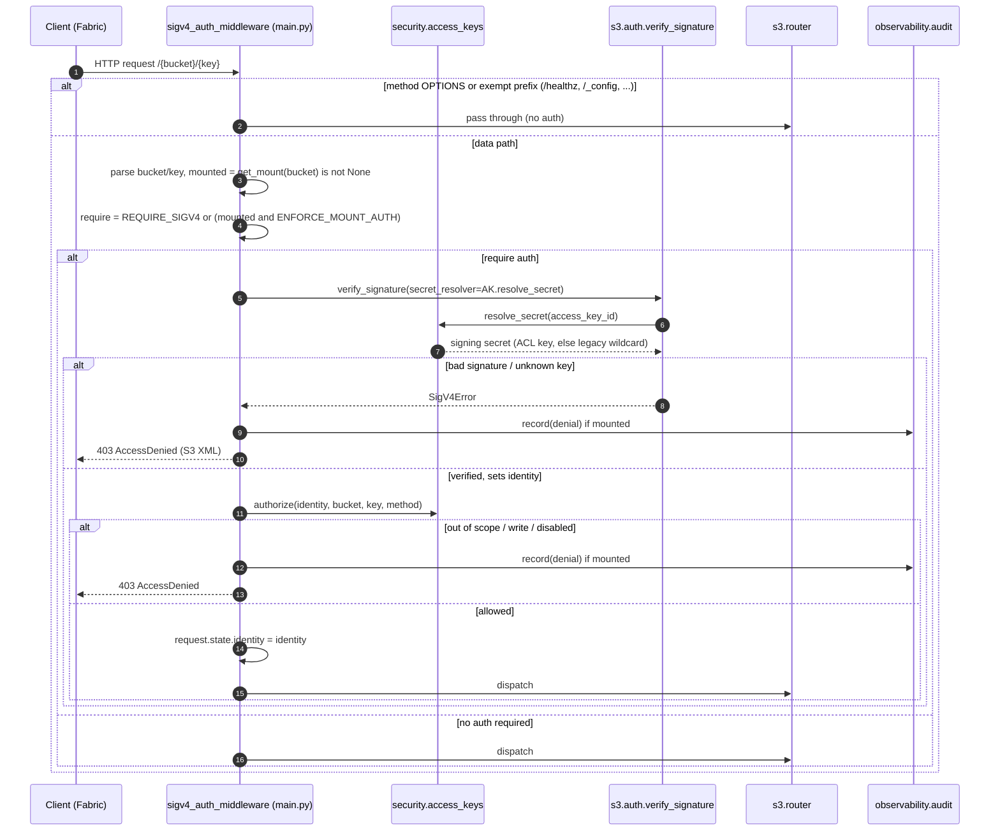

---

## 4. Access keys + per-key authorization (ACL)

Grounded in [security/access_keys.py](../security/access_keys.py) and
[security/credential_store.py](../security/credential_store.py).

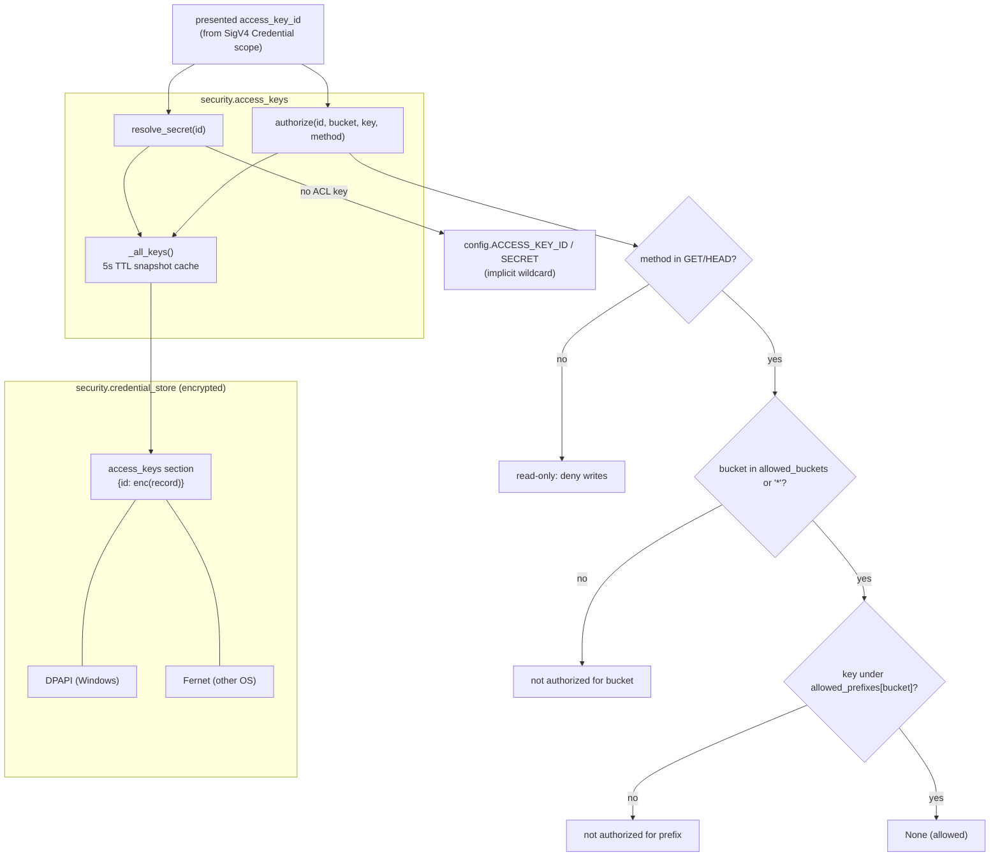

Record shape (encrypted at rest): `{access_key_id, secret_key, label,
allowed_buckets, allowed_prefixes, permissions, enabled}`.

---

## 5. Warehouse read path — metadata & data

The DB→table serving path in [s3/router.py](../s3/router.py) `get_object`.

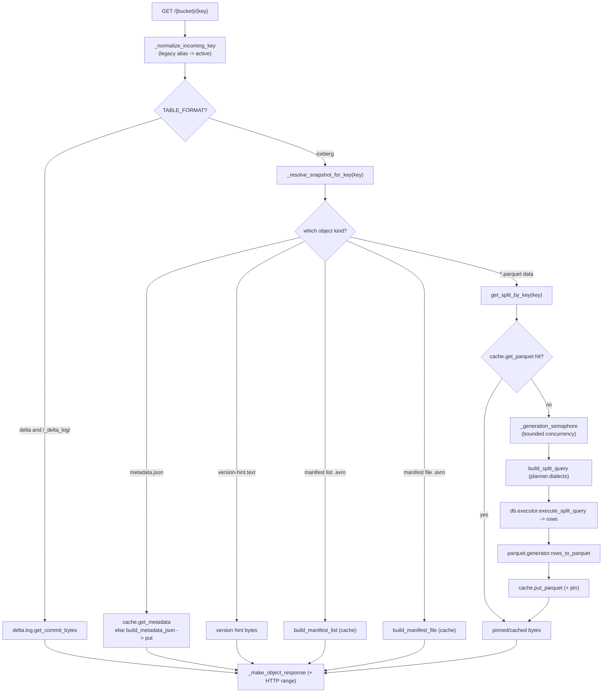

Data-generation timing (`querystats.record_query`) captures SQL vs generation vs
total ms per split. Referenced: [planner/split_planner.py](../planner/split_planner.py),
[db/executor.py](../db/executor.py), [parquet/generator.py](../parquet/generator.py),
[cache/lru_cache.py](../cache/lru_cache.py).

---

## 6. Snapshot state & data freshness

Deterministic, content-addressed snapshots. Grounded in
[iceberg/state_store.py](../iceberg/state_store.py) and [iceberg/freshness.py](../iceberg/freshness.py).

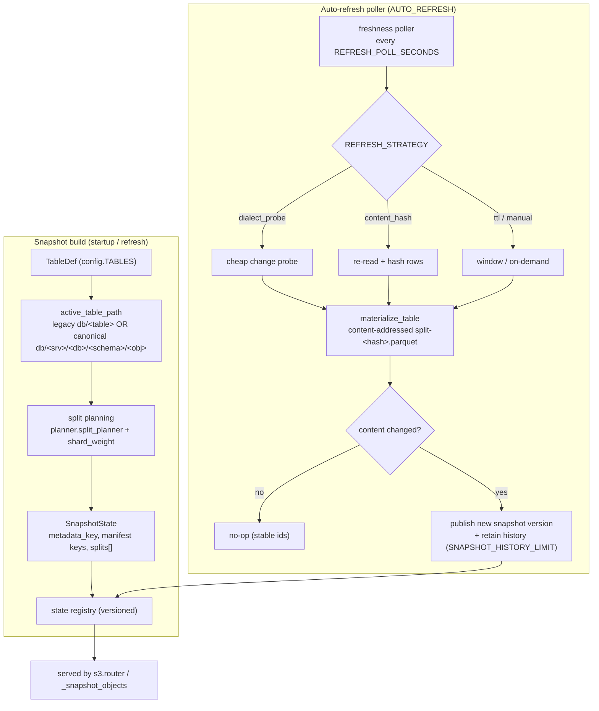

Each split file is named by the hash of **its rows**, so identical data is
restart-stable and any change yields a new path + `current-snapshot-id`.

---

## 7. Storage proxy — passthrough serving

Read-only byte passthrough for mounted buckets. Grounded in
[storage/passthrough.py](../storage/passthrough.py) and [storage/mounts.py](../storage/mounts.py).

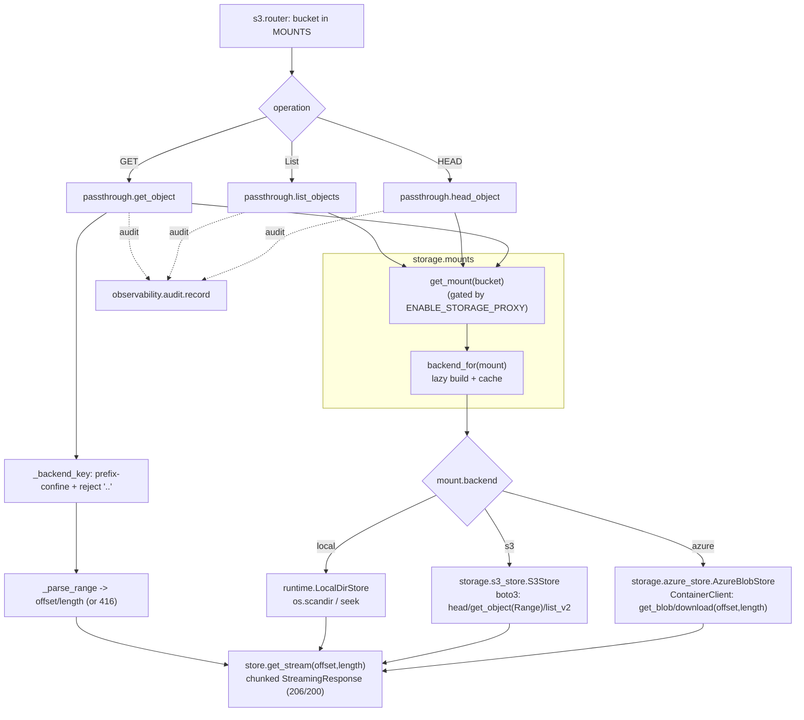

Backends implement the same [runtime/artifact_store.py](../runtime/artifact_store.py)
`ArtifactStore` interface (`head`, `get_stream`, `list`, `list_dir`), so serving
code is backend-agnostic.

---

## 8. Outbound credential mediation

Upstream secrets never reach the client. Grounded in
[storage/s3_auth.py](../storage/s3_auth.py), [storage/azure_auth.py](../storage/azure_auth.py),
and [security/credential_store.py](../security/credential_store.py).

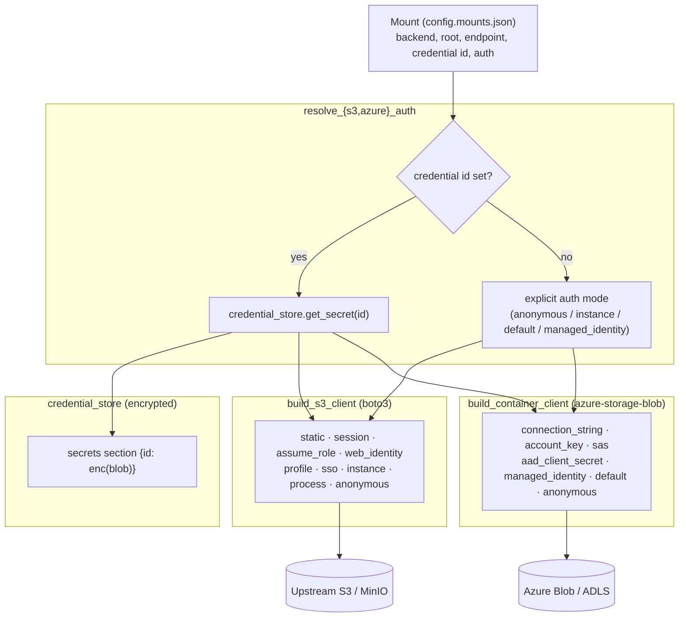

Non-secret knobs (endpoint, region, addressing/signature style, TLS verify) live
on the mount; secret material lives only in the encrypted store.

---

## 9. Caching & artifact store

Grounded in [cache/lru_cache.py](../cache/lru_cache.py) and
[runtime/artifact_store.py](../runtime/artifact_store.py).

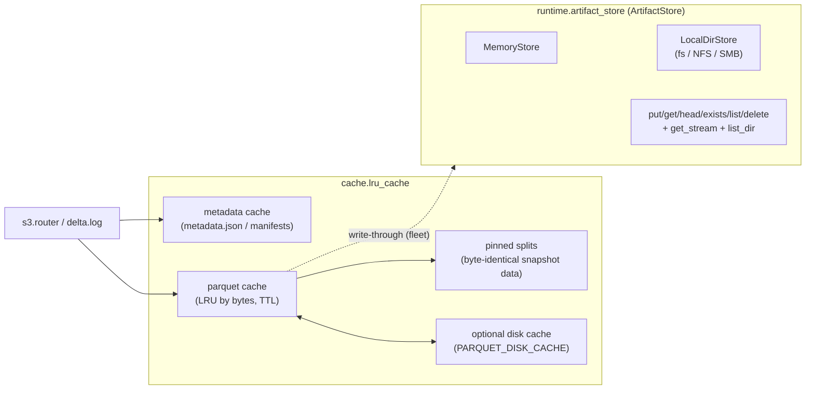

In fleet mode the parquet cache can write through to a shared `ArtifactStore` so
stateless Agents serve the Manager's published splits.

---

## 10. Configuration system

Layered, multi-file config with a settings registry. Grounded in
[config.py](../config.py), [system_config.py](../system_config.py),
[connection_config.py](../connection_config.py).

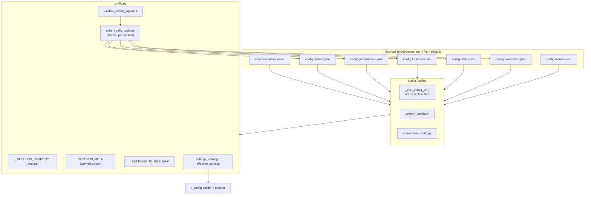

Secret material (DB URLs, upstream creds, access keys) is **not** stored in these
JSON files — it lives in the encrypted credential store.

---

## 11. Manager / Agent control plane (fleet)

Stateless Agents behind a Manager. Grounded in [control/](../control) —
`registry.py`, `supervisor.py`, `gateway.py`, `lease.py`, `admin.py`,
`contract.py`, and [runtime/agent_link.py](../runtime/agent_link.py).

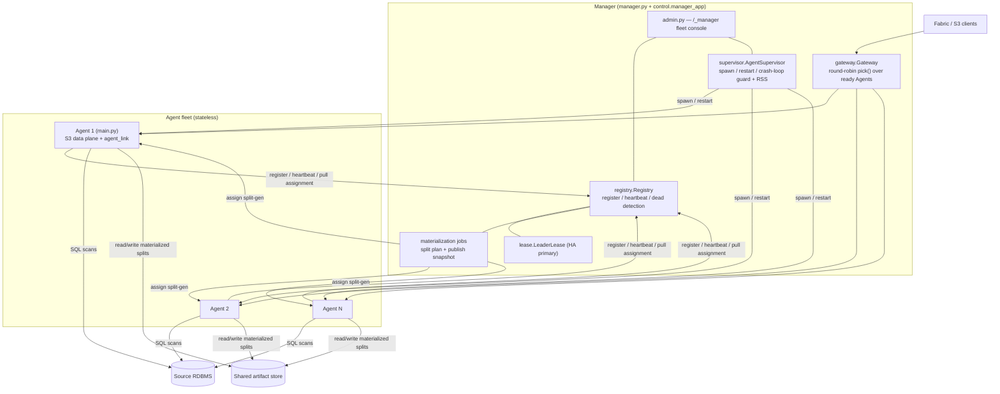

### 11a. Register / heartbeat contract

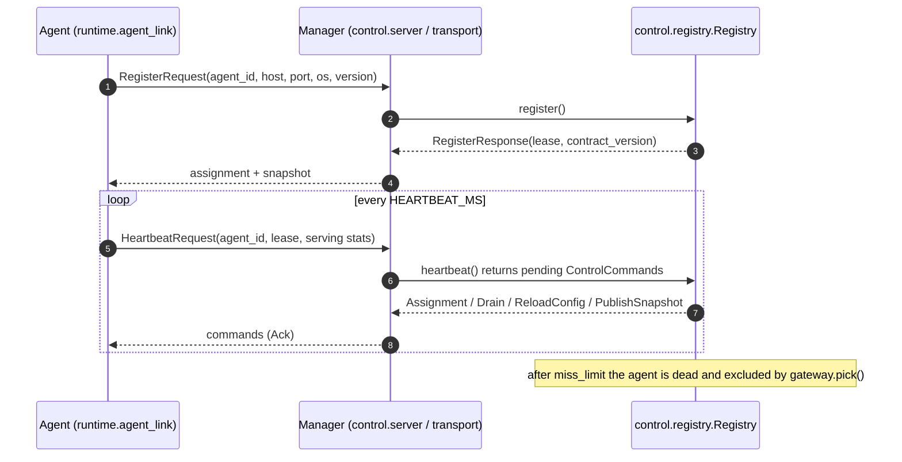

Message shapes are transport-neutral dataclasses in
[control/contract.py](../control/contract.py) with a dict/JSON codec, mirrored by
`control/proto/control.proto`.

---

## 12. Observability & audit

Grounded in [observability/](../observability) — `logging.py`, `metrics.py`,
`trace.py`, `querystats.py`, `audit.py`, `endpoints.py`.

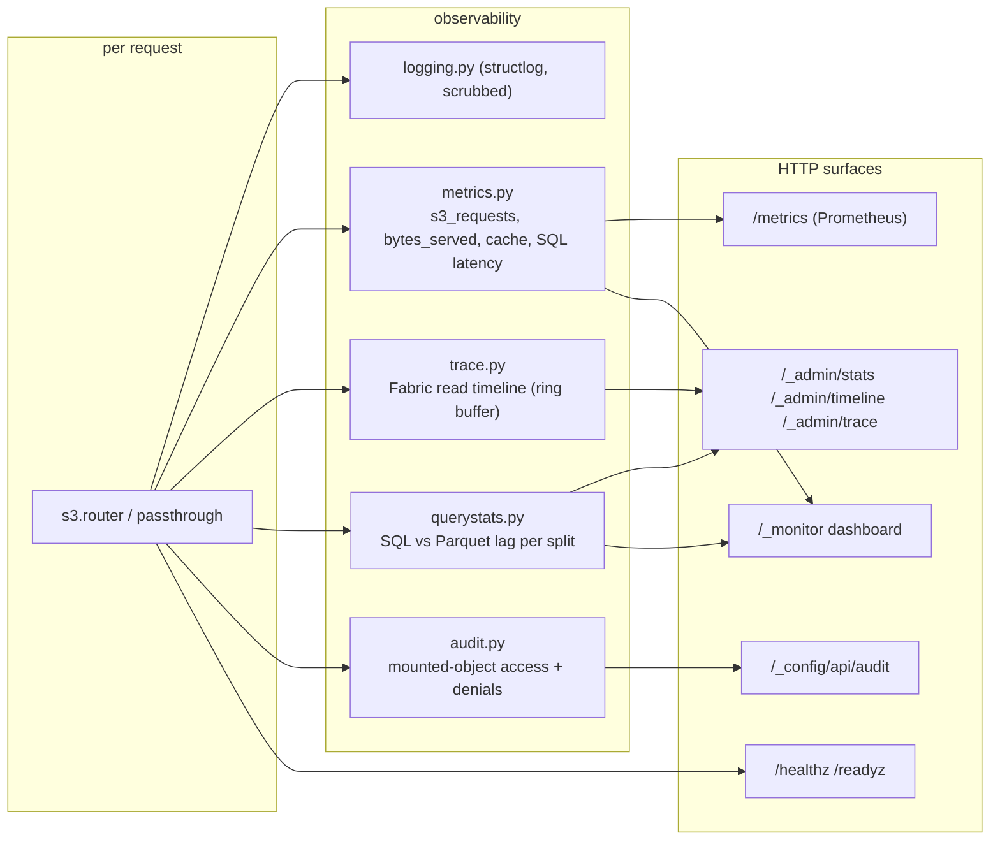

Audit events (`identity, client, bucket, key, backend, method, status, bytes`)
are emitted for every mounted-object access and for auth/authz denials, secrets
scrubbed, with an in-memory ring surfaced at `/_config/api/audit`.
