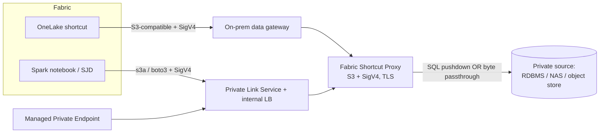

# Use Cases & Scenarios: Private-Infrastructure Connectivity

How to surface data into Microsoft Fabric through the Fabric Shortcut Proxy **without
exposing the data endpoint to the public internet**: across on-premises, Azure vNet, and other-cloud (AWS/GCP)
private infrastructure. Scenarios are split by consumption style (**Fabric shortcuts**
vs **Fabric Spark**) because each reaches a private endpoint through a different Fabric
mechanism.

> Companion docs: [README.md](../README.md) (setup),
> [TechnicalArchitecture.md](TechnicalArchitecture.md) (per-process flows),
> [SECURITY.md](SECURITY.md) (auth/TLS/audit/credential mediation),
> [CONFIGURATION.md](CONFIGURATION.md) (settings).
>
> **Setup guide:** step-by-step wiring for the connectivity patterns below (OPDG shortcut,
> Spark MPE/PLS, storage-proxy mounts) is in [CONNECTIVITY_SETUP.md](CONNECTIVITY_SETUP.md).

Grounded in the Fabric connectivity mechanisms documented at:
- On-premises data gateway shortcuts, <https://learn.microsoft.com/fabric/onelake/create-on-premises-shortcut>
- Managed private endpoints (Spark), <https://learn.microsoft.com/fabric/security/connect-to-on-premise-sources-using-managed-private-endpoints>
- Managed virtual networks, <https://learn.microsoft.com/fabric/security/security-managed-vnets-fabric-overview>
- Private links for Fabric, <https://learn.microsoft.com/fabric/security/security-private-links-overview>

---

## The two connectivity primitives

Everything below rests on two Fabric features that keep source and data-plane traffic on a private route, one per consumption style. Fabric service connectivity is still required.

**Shortcut path → On-premises data gateway (OPDG).** OneLake S3-compatible shortcuts can
target a gateway installed inside your private network. The gateway bridges OneLake to
endpoints like `http://10.0.1.4:9000` or `https://mys3api.contoso.com`, explicitly
supported for on-prem, firewall/VPC, and network-restricted S3-compatible storage.
Shortcut caching (1–28 day retention) reduces repeat egress.

**Spark path → Managed Private Endpoint (MPE) + Private Link Service (PLS).** A Fabric
workspace on a Managed VNet creates an outbound MPE to an Azure Private Link Service that
fronts the proxy (internal Standard LB → PLS). Approved once, Spark notebooks / Spark job
definitions read over the Microsoft backbone. For on-prem or other-cloud, the PLS sits on a
forwarding VM (DNAT) reachable over ExpressRoute/VPN.

The proxy is well suited to sit behind either primitive: a single S3-compatible endpoint
with SigV4 + per-key ACLs, TLS, upstream **credential mediation** (Fabric never sees the
source secrets), and two data paths, DB→Iceberg/Delta virtualization *and* file/object
passthrough (`local` NFS/SMB, `s3`/MinIO, `azure` blob).

## A third delivery mode: Open Mirroring

Open Mirroring is a separate write path from shortcut and Spark consumption. The Manager
reads selected source tables through the existing database connectors and publishes
Fabric-compatible metadata and numbered Parquet files into a OneLake mirrored-database
landing zone. Fabric's mirroring service consumes those files and maintains a durable copy
in OneLake.

This path does not require Fabric to read the proxy's S3 endpoint. The proxy instead needs
outbound access to the OneLake landing zone and an Entra identity with the required Fabric
and storage permissions. Source access remains private to the proxy's network. A local or
UNC landing-zone root can be used for staging and tests.

Choose the tracking strategy per table:

- **Watermark incremental:** set `watermark_column` for ordered source-incremental upserts.
  This minimizes source reads but does not detect deletes or changes that do not advance the
  watermark.
- **Snapshot diff:** omit `watermark_column` to scan the source and compare row-hash state.
  This detects inserts, updates, and deletes but reads the source on every cycle.

Open Mirroring can run beside shortcuts. Use a shortcut when consumers need live, governed
read access without a durable copy; use Open Mirroring when a durable OneLake copy or
incremental replication is required. The two paths have independent state and refresh
lifecycle.

---

## Use-case matrix

| # | Consumption | Environment | Proxy data path | Private link mechanism |
|---|---|---|---|---|
| 1 | **Shortcut** | On-prem | DB→Iceberg/Delta (SQL Server/Oracle) | OPDG in the same LAN |
| 2 | **Shortcut** | On-prem | Passthrough (NAS: NFS/SMB) | OPDG in the same LAN |
| 3 | **Shortcut** | Other cloud (AWS/GCP) | Passthrough (MinIO/S3) or DB (RDS) | OPDG inside the VPC |
| 4 | **Spark** | Azure vNet | DB (Azure SQL MI / Postgres, no public IP) | MPE → PLS (internal LB) |
| 5 | **Spark** | Azure vNet | Passthrough (private ADLS/MinIO) | MPE → PLS |
| 6 | **Spark** | On-prem (regulated) | DB→Delta (Oracle) | MPE → PLS on forwarding VM (DNAT) over ExpressRoute |
| 7 | **Shortcut + Spark** | Multi-cloud mesh | Fleet: many mounts, one endpoint | OPDG per site + MPE for Azure-resident |
| 8 | **Shortcut** | Cross-tenant/regulated | DB or passthrough | OneLake Private Link (same-tenant) + OPDG |
| 9 | **Open Mirror** | On-prem / private cloud | Source DB → OneLake landing zone | Proxy outbound Entra identity; source stays private |
| 10 | **Shortcut + Open Mirror** | Any private environment | Virtual shortcut plus durable mirrored copy | OPDG or MPE for reads; private outbound path for publishing |
| 11 | **Open Mirror** | Multi-cloud | Watermark or snapshot-diff publishing | Proxy in source VPC/VNet with controlled OneLake egress |

---

## Flagship scenarios

### 1: On-prem OLTP as a live Lakehouse table, zero copy [Shortcut]

The proxy runs beside an on-prem SQL Server/Oracle, exposing a table as Iceberg/Delta. An
OPDG on the same LAN bridges OneLake to `http://proxy:9000`; a Fabric S3-compatible
shortcut (bound to a scoped SigV4 key) makes it a Lakehouse table feeding a Direct Lake
model. Only the queried rows traverse the gateway; nothing lands in a public bucket, and
shortcut caching absorbs repeat reads. This is the proxy's core DB-virtualization value
with private connectivity.

### 2: On-prem files as a governed Fabric table, zero copy [Shortcut]

The proxy runs beside an NFS or SMB share and exposes a read-only `local` mount through
the same S3 endpoint as the warehouse. An OPDG reaches the private proxy, while scoped
SigV4 access keys restrict each team to its bucket and prefix. Fabric reads the existing
objects without moving them into a public bucket; TLS and audit logging protect and record
the access path.

### 3: Consolidate AWS-resident data into Fabric without public egress [Shortcut]

The proxy runs on an EC2/EKS host in the AWS VPC, with an `s3` mount to a VPC-internal
MinIO bucket (or DB-virtualization over RDS). The proxy holds the AWS credentials; Fabric
only ever sees SigV4. An OPDG installed on a Windows host in the same VPC is selected in
the shortcut's **Data gateway** dropdown, so OneLake reaches the VPC-private endpoint
directly. No bucket is exposed to the internet, and no AWS keys are handed to Fabric.

### 4: vNet-isolated Spark analytics over a private Azure DB [Spark]

The proxy runs in an Azure VNet (VM/AKS/Container Apps) behind an internal Standard LB +
Private Link Service, virtualizing an Azure SQL MI / Postgres Flexible Server that has *no*
public endpoint. The Fabric workspace (Managed VNet) creates an MPE to the PLS; after
approval, a Spark notebook does `spark.read.format("delta")` via `s3a`/boto3 against the
proxy's private FQDN. Heavy distributed joins/transforms run in Spark, the source DB stays
private, and every object read is audit-logged by the proxy.

### 5: Private Azure storage for Spark without public storage access [Spark]

The proxy runs in an Azure VNet and exposes a private ADLS Gen2 container or MinIO bucket
through an `azure` or `s3` mount. An internal Standard LB and PLS provide the private
endpoint for the Fabric workspace MPE. Spark reads the mounted objects with ranged S3
requests, while the storage credential stays in the proxy's encrypted credential store.
This pattern is useful when the storage account cannot expose a public endpoint and the
workspace should not receive its account key or SAS token.

### 6: Air-gapped / regulated Spark ETL against on-prem Oracle [Spark]

Where policy forbids any public path, front the on-prem proxy with the "Direct Connect"
pattern: a forwarding VM (iptables DNAT/MASQUERADE) + PLS on the Azure side of an
ExpressRoute/VPN, and a Fabric MPE to that PLS. Spark reads Oracle-as-Delta entirely over
private links, with credential mediation keeping the Oracle secret out of Fabric.

### 7: Multi-cloud data mesh on one endpoint [Shortcut + Spark]

Run the Manager/Agent fleet; each mount is a different private backend (on-prem NAS, AWS
MinIO, Azure ADLS, on-prem Oracle). One SigV4 endpoint, with per-key ACLs scoping each
domain team to its buckets/prefixes (read-only). Domains that just browse files use
shortcuts via OPDG; domains doing transforms use Spark via MPE, all against the same
governed front door.

### 8: Cross-tenant or regulated shortcut access [Shortcut]

For a same-tenant OneLake Private Link deployment, place the proxy behind the approved
private endpoint and keep the OPDG path for sources that remain on-premises or in another
cloud. Use separate scoped SigV4 keys and bucket/prefix ACLs for each tenant or regulated
domain. This keeps the data endpoint private while allowing Fabric shortcuts to reach
different virtual tables or mounts through one governed service.

### 9: Replicate an on-prem source into OneLake [Open Mirror]

Run the Manager beside the private SQL Server or Oracle source and configure an Open Mirror
target whose landing-zone root is the destination mirrored database in OneLake. The Manager
uses the proxy's Entra identity to write table metadata and numbered Parquet batches; Fabric
consumes those files without connecting to the source database. Use a `watermark_column` for
source-incremental upserts when the source has a suitable monotonic value, or snapshot diff
when delete detection is required.

### 10: Serve a live shortcut and a durable copy together [Shortcut + Open Mirror]

Expose a source table through a private shortcut for low-latency or selective reads, while
the Open Mirror publisher sends the same or a curated table set into OneLake for durable
analytics and downstream workloads. Shortcut refresh and mirror publishing are independent:
one can continue serving the source while the other catches up, and each has its own state,
retention, and operational monitoring.

### 11: Replicate multi-cloud sources with controlled egress [Open Mirror]

Place an agent or Manager inside the source VPC or VNet, bind targets to the existing AWS,
Azure, or other supported source connections, and allow only the required outbound OneLake
traffic. Use watermark tracking for high-volume ordered changes; use snapshot diff for
tables where updates and deletes must be detected without a reliable watermark. Fabric
receives a durable copy while source credentials and private network access remain inside
the customer-controlled environment.

---

## Why the proxy fits "private infrastructure without a public data endpoint"

- **Credential mediation**: upstream S3/Azure/DB secrets are held encrypted (DPAPI/Fernet)
  and resolved by id; Fabric only presents SigV4. Cross-cloud keys never leave the private
  environment.
- **Per-key ACL + forced mount auth**: a secured mount is never anonymous, even with
  `REQUIRE_SIGV4=0`.
- **TLS at the proxy or fronting LB**, plus an audit log per mounted-object access.
- **Three delivery modes**: live SQL pushdown and file passthrough through shortcuts, plus
  optional Open Mirror publishing into OneLake, so one private deployment can serve and
  replicate governed data.

---

## Key asymmetry: shortcuts vs Spark

| | Reaches private endpoint via | Works for |
|---|---|---|
| **Shortcuts** | On-premises data gateway (OPDG) | On-prem, AWS/GCP VPCs, firewall/network-restricted |
| **Spark** | Managed Private Endpoint → Private Link Service | In-VNet (trivial); on-prem/other-cloud via a forwarding VM + ExpressRoute/VPN |
| **Open Mirror** | Proxy outbound OneLake/Entra path | Durable replication from a private source; watermark or snapshot-diff publishing |

Shortcuts reach private endpoints cross-cloud through OPDG; Spark reaches them
through an Azure-fronted PLS, which is trivial in-VNet and needs a forwarding VM for
on-prem or other-cloud sources. Open Mirror is different: Fabric consumes files from
OneLake after the proxy publishes them, so its private-network requirement is source access
plus controlled outbound access from the proxy to the landing zone.
