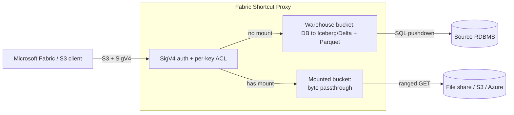

# Chapter 1: Introduction

## 1.1 What the proxy does

The Fabric Shortcut Proxy exposes an S3-compatible endpoint. Microsoft Fabric (or
any S3 client) reads from it with AWS SigV4 authentication. Behind that endpoint the
proxy answers reads in one of two ways, chosen per bucket:

- **Warehouse mode.** The proxy presents a relational table as a set of Iceberg or
  Delta table objects. When Fabric asks for a data file, the proxy runs a SQL
  pushdown query against the source database and returns the result as Parquet,
  generated on demand.
- **Storage-proxy mode.** The proxy streams the bytes of an existing object from a
  mounted backend (a file share, an S3 bucket, or an Azure container) as read-only
  passthrough, with range support.

Both modes sit behind the same SigV4 front door and the same audit seam. A single
deployment can serve database-backed tables and mounted file shares at the same time.

The source database credentials never leave the proxy. Fabric presents SigV4 keys to
the proxy; the proxy holds the database password and the upstream storage credentials
itself. This credential mediation is what lets Fabric read private data without a copy
and without direct access to the source.

## 1.2 The two serving modes

A bucket resolves through the warehouse path unless it has a mount. Adding a mount to
a bucket switches it to passthrough. Nothing about the warehouse path changes when you
add mounts to other buckets.

## 1.3 What it produces

The proxy publishes tables in one of two open formats from the same query path:

- **Iceberg** (`TABLE_FORMAT=iceberg`): `metadata.json`, an Avro manifest list and
  manifest files, and `version-hint.text`, with on-demand Parquet data files.
- **Delta** (`TABLE_FORMAT=delta`): a native `_delta_log` that Fabric reads directly
  with no Iceberg-to-Delta conversion layer.

Delta is often the better choice for Fabric because Fabric reads `_delta_log` natively.
See [DELTA_FORMAT.md](../DELTA_FORMAT.md) for the commit model and type mapping.

## 1.4 Supported sources

| Source | Driver | Notes |
|---|---|---|
| SQLite | `aiosqlite` (bundled) | demo and development |
| SQL Server | `aioodbc` + ODBC Driver 18 | bundled driver; install the OS ODBC driver |
| PostgreSQL | `asyncpg` (`[postgres]` extra) | |
| Oracle | `oracledb` (`[oracle]` extra) | |
| Databricks SQL | `databricks-sqlalchemy` (bundled) | requires an HTTP path to a SQL warehouse |

Storage-proxy mounts add three passthrough backends: `local` (a filesystem path,
including an OS-mounted NFS or SMB share), `s3` (S3, MinIO, or S3-compatible), and
`azure` (Azure Blob or ADLS Gen2).

## 1.5 Editions

The project ships as two distributions built from one repository.

| Edition | Package | Entry point | Use when |
|---|---|---|---|
| **Lite** | `fabric-shortcut-proxy` | `python main.py` | Single-node proxy; one agent process |
| **Enterprise (cluster)** | `fabric-shortcut-proxy-enterprise` | `python -m enterprise.manager` | Manager control plane supervising one or more agents, gateway load balancing, leader-lease HA, retention GC |

The enterprise wheel is pinned to the exact Lite core version it was built against
(`fabric-shortcut-proxy==2.5.1`). The `Manager.ps1` and `Manager.sh` launchers bootstrap
the virtual environment and start the cluster edition. A Lite-only install runs the
standalone proxy unchanged.

Chapter 4 covers installing each edition. Chapter 8 covers scaling with the Manager and
Agent model.

## 1.6 Where it fits

The proxy is built for private-infrastructure connectivity: making on-premises or
private-network data readable in Fabric without copying it and without a public data
path. The two common topologies are:

- **Private (recommended):** an On-Premises Data Gateway (OPDG) fronts the proxy, and
  Fabric reaches the proxy only through the gateway. The proxy has no public listener.
- **Public internet:** the proxy is exposed behind a TLS endpoint and Fabric connects
  to it directly. No OPDG is involved.

Chapter 6 covers both. The scenario catalog is in
[UsecasesAndScenarios.md](../UsecasesAndScenarios.md).

## 1.7 What it is not

- It is not a write path. Reads are served; write methods are denied.
- It is not a cache of your database. Data files are generated on demand from live
  SQL and refreshed on a content-addressed schedule (chapter 2).
- It is not a replacement for a reviewed tokenization or masking service. The
  tokenization feature (chapter 7) pushes hashing into the source engine for column
  minimization, not reversible detokenization.

## 1.8 Next

Continue to [Chapter 2: Core concepts](02-concepts.md) for the model behind splits,
snapshots, canonical paths, and freshness, which the rest of the manual builds on.
