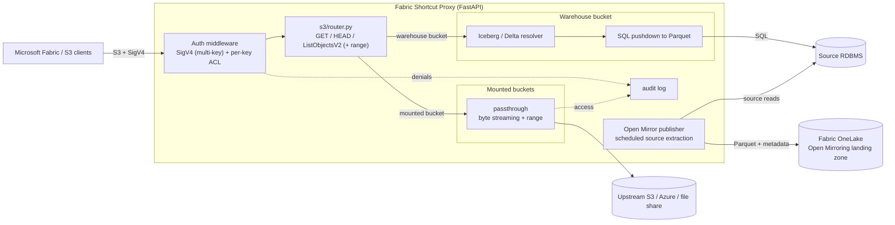
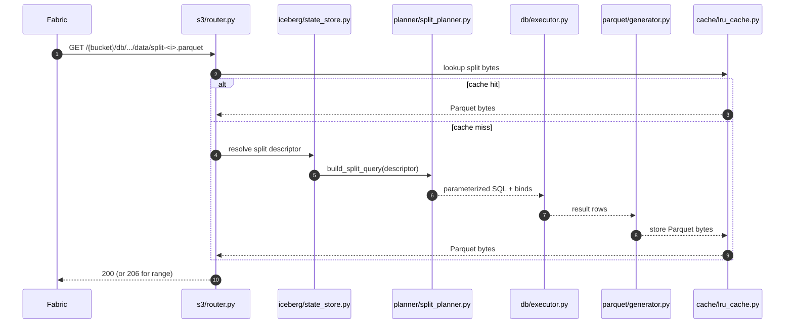
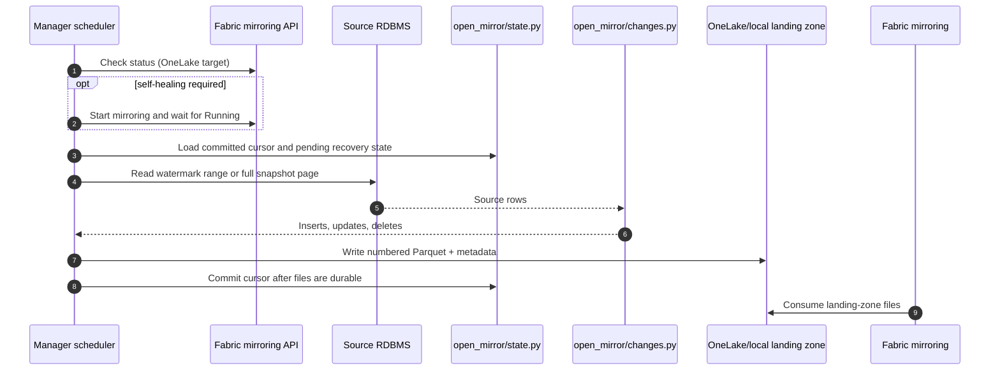
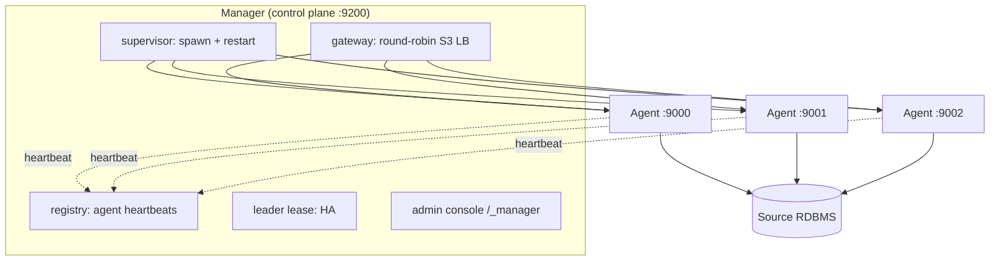

# Chapter 3: Architecture

This chapter maps the concepts from chapter 2 onto real processes and modules. It
covers the request lifecycle, the split between the data plane and the control plane,
and the Manager/Agent model used by the enterprise edition. Component-level flow
diagrams for every subsystem live in [TechnicalArchitecture.md](../TechnicalArchitecture.md);
this chapter gives you the working model you need before installing or operating.

## 3.1 The big picture

Everything a client sees enters through the S3 front door in `main.py` and
`s3/router.py`. Auth is a middleware; routing to warehouse or mount happens per bucket.

## 3.2 Module map

The codebase is organized by responsibility. The groups below are the ones you touch
when reading, configuring, or extending the proxy.

| Group | Modules | Responsibility |
|---|---|---|
| Entrypoints | `main.py`, `enterprise/manager.py` | The Agent app (data plane) and the Manager app (control plane) |
| S3 front door | `s3/router.py`, `s3/auth.py`, `s3/xml_responses.py` | Endpoints, SigV4 verification, S3 XML bodies |
| Security | `security/access_keys.py`, `security/credential_store.py`, `security/credentials.py` | Scoped keys + ACL, encrypted store, secret scrubbing |
| Table metadata | `iceberg/` (`schema`, `metadata`, `manifest`, `stats`, `state_store`, `freshness`), `delta/log.py` | Iceberg and Delta metadata, snapshot registry, freshness |
| Generation | `planner/` (`split_planner`, `dialects`, `shard_weight`), `db/` (`executor`, `reflect`, `capabilities`), `parquet/generator.py` | Plan splits, generate SQL, run it, encode Parquet |
| Storage proxy | `storage/mounts.py`, `storage/passthrough.py`, `storage/s3_store.py`, `storage/azure_store.py` | Mount registry and byte passthrough backends |
| Open Mirror | `open_mirror/` (`source`, `changes`, `publisher`, `landing_zone`, `metadata`, `manifest`, `state`) | Read source tables, compute changes, write Fabric landing-zone files, and commit restart-safe state |
| Runtime & cache | `runtime/artifact_store.py`, `cache/lru_cache.py` | Published artifact store, in-memory/disk Parquet cache |
| Control plane | `enterprise/control/` (`registry`, `supervisor`, `gateway`, `lease`, `admin`, `contract`, `transport`) | Registry, supervision, gateway LB, HA, admin console |
| Observability | `observability/` (`logging`, `metrics`, `endpoints`, `trace`, `querystats`, `audit`) | Structured logs, metrics, health/admin endpoints, tracing, audit |
| Configuration | `config.py`, `system_config.py`, `connection_config.py` | Settings model, validation, effective config |

The full module diagram with edges is in
[TechnicalArchitecture.md §2](../TechnicalArchitecture.md).

## 3.3 The warehouse read path

When Fabric requests a data file from a warehouse bucket, the request flows through the
metadata resolver, the planner, the executor, and the Parquet generator.

Key properties:

- The SQL is always parameterized. No free-form SQL from configuration reaches the
  database.
- Generated bytes are cached in memory and, when enabled, on disk. Pinned snapshot
  splits stay byte-identical while their snapshot is current.
- The planner picks range, modulo, or row-number sharding per chapter 2.

## 3.4 The mount read path

When a bucket has a mount, the router hands the request to the passthrough layer, which
streams object bytes from the configured backend with range support. No SQL, no Parquet,
no schema; the bytes are served as-is. The mount registry (`storage/mounts.py`) validates
every key, rejects `..` traversal, and confines reads to the mount prefix subtree. Chapter
6 covers configuring mounts; chapter 7 covers the forced-auth and audit behavior.

## 3.5 The Open Mirror publishing path

Open Mirror publishing is a write workflow owned by the Manager, not an S3 request path.
The scheduler selects enabled targets, performs the optional Fabric mirroring preflight,
and invokes the source publisher for each configured table.

Watermark mode reads only rows after the committed cursor, while snapshot mode compares
the full source against local row-hash state to produce row markers, including deletes.
Pending batches and unreadable state are treated as recovery conditions rather than silently
starting a new full load. An operator must use the explicit reset action for that behavior.

The landing-zone backend is interchangeable: OneLake uses the proxy's configured Entra
identity, while local or UNC roots support staging and tests. Fabric-specific metadata and
20-digit file sequencing are generated by `open_mirror/metadata.py` and
`open_mirror/manifest.py`; `open_mirror/publisher.py` writes the table files.

## 3.6 Data plane vs control plane

The proxy separates two concerns onto two ports:

| Plane | Process | Default port | Faces | Purpose |
|---|---|---|---|---|
| **Data plane** | Agent (`main.py`) | 9000 (and 9001…) | Fabric / OPDG | Serves S3 reads: warehouse and mounts |
| **Control plane** | Manager (`enterprise/manager.py`) | 9200 | Admins only | Supervises agents, config API, console, gateway |

The data plane is what Fabric reads. The control plane supervises the fleet and hosts
the config builder (`/_config`), the monitor (`/_monitor`), and the admin console
(`/_manager`). Keep the control port private.

In the Lite edition there is no Manager: `python main.py` runs a single Agent that serves
both the data endpoints and, if enabled, the config/monitor surfaces on its own port.

## 3.7 The Manager/Agent model (enterprise)

The enterprise edition adds a Manager that supervises one or more Agent processes and,
optionally, fronts them with a built-in gateway.

- **Registry** tracks which agents are heartbeating and ready.
- **Supervisor** spawns agents, watches their health and memory, and restarts on crash.
- **Gateway** round-robins ready agents behind a single Fabric-facing endpoint; agents
  are interchangeable because they serve from the shared artifact store.
- **Leader lease** provides optional HA: only the primary Manager supervises agents; a
  standby is a warm spare.
- **Retention GC** prunes orphaned Parquet splits on a timer.

For production you can also front the agents with an external L7 load balancer instead of
the built-in gateway. See [EXTERNAL_LB_RUNBOOK.md](../EXTERNAL_LB_RUNBOOK.md). The scale
design is in [SCALE_ARCHITECTURE_PLAN.md](../SCALE_ARCHITECTURE_PLAN.md).

## 3.8 The artifact store

Published table images (metadata plus data splits) live in an artifact store so any agent
can serve any split. The default backend is a local directory; the store abstraction
(`runtime/artifact_store.py`) is what makes agents stateless and interchangeable behind the
gateway. A complete "serving image" can be published and served directly, including by the
optional standalone C++ serving agent.

## 3.9 Configuration surfaces

Configuration resolves from three surfaces, highest precedence first: environment
variables, external JSON files, then built-in defaults. The JSON is split by concern
(`config.system.json`, `config.connection.json`, and the table registry) so secrets and
structure stay separated. Chapter 5 covers the full model; the settings registry in
`config.py` is the source of truth.

## 3.10 Next

Continue to [Chapter 4: Installation](04-installation.md) to stand up either edition, or
jump to [Chapter 8: Operations](08-operations.md) for running and scaling the fleet.
