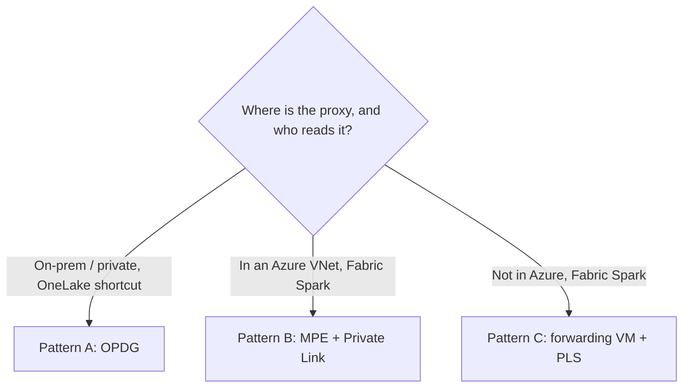

# Chapter 6: Connecting Microsoft Fabric

This chapter wires Microsoft Fabric to the tables and mounts you configured in chapter 5.
It covers the shortcut setup, the three network patterns (OPDG, Managed Private Endpoint,
and a forwarding VM), the Spark read path, and mounting existing files. The full networking
reference with Azure CLI recipes is in [CONNECTIVITY_SETUP.md](../CONNECTIVITY_SETUP.md); the
scenario catalog is in [UsecasesAndScenarios.md](../UsecasesAndScenarios.md).

## 6.1 The common baseline

Every pattern reuses the same S3 endpoint; only the Fabric-side networking and client
differ. Set these in `config.system.json` before you connect anything:

```json
{
  "system": {
    "bucket": "fabric-iceberg-poc",
    "require_sigv4": true,
    "table_format": "delta"
  }
}
```

- `require_sigv4: true` — Fabric presents SigV4 and the proxy verifies it.
- `table_format: delta` — Fabric reads `_delta_log` directly, recommended especially for
  Spark.
- SigV4 keys (`S3_ACCESS_KEY_ID` / `S3_SECRET_ACCESS_KEY`, or scoped access keys) are the
  only credentials Fabric ever sees. The source database and upstream storage secrets stay
  inside the proxy.

## 6.2 Choosing a network pattern



| Pattern | Reader | Fabric to proxy path | Public exposure |
|---|---|---|---|
| A. Private (recommended) | OneLake shortcut | OPDG dials the proxy's private IP | None |
| B. In-VNet Spark | Fabric Spark | Managed Private Endpoint to a Private Link Service | None |
| C. Non-Azure Spark | Fabric Spark | MPE to a PLS fronting a forwarding VM | None |
| Public variant | OneLake shortcut | Direct HTTPS to a TLS FQDN, no OPDG | 443 only |

## 6.3 Pattern A: OneLake shortcut via OPDG

Use this for OneLake shortcuts reaching a proxy with no public data endpoint. The On-Premises
Data Gateway carries source and data-plane traffic to the private proxy; Fabric service
connectivity is still required.

1. **Install and register the OPDG** (standard mode) on a Windows host that can reach the
   proxy on the same LAN or VNet. Sign in with your Fabric account and register it to your
   tenant. Confirm it shows online in Fabric admin under Connections and gateways.
2. **Open the proxy port to the gateway host only.** Allow the OPDG IP to reach the agent
   port (9000) and keep the control plane (9200) closed to everyone but admins.

   ```bash
   sudo ufw allow from <opdg-host-ip> to any port 9000 proto tcp
   ```
3. **Create the shortcut** in a Fabric Lakehouse: New shortcut → Amazon S3 compatible.

   | Field | Value |
   |---|---|
   | URL | `http://<proxy-private-ip>:9000` |
   | Access key / Secret | your `S3_ACCESS_KEY_ID` / `S3_SECRET_ACCESS_KEY` |
   | Data gateway | select your OPDG |
   | Path | browse the `fabric-iceberg-poc` bucket, pick the table folders |

Only the queried rows traverse the gateway.

## 6.4 The shortcut path

Point the shortcut at the metadata entry point under the canonical path (chapter 2):

- Iceberg: `db/<server>/<database>/<schema>/<object>/metadata/v1.metadata.json`
- Delta: `db/<server>/<database>/<schema>/<object>`

Fabric discovers the remaining objects from that entry point.

## 6.5 Pattern B: Fabric Spark via Managed Private Endpoint

Use this when Fabric Spark reads a proxy running in an Azure VNet. Spark reaches it over the
Microsoft backbone through a Managed Private Endpoint to a Private Link Service, with no
public exposure.

```
Fabric Spark (Managed VNet) — MPE — Private Link Service — internal Std LB — proxy :9000
```

The proxy uses the same baseline; set `forwarded_allow_ips` to the load-balancer subnet so
the audit log records the real client IP. Then, in the proxy's VNet, create a Standard
internal load balancer with a `/readyz` health probe and a Private Link Service in front of
it, add the proxy NICs to the backend pool, and approve the MPE connection on the PLS. The
exact Azure CLI is in [CONNECTIVITY_SETUP.md §2](../CONNECTIVITY_SETUP.md).

Read from a Spark notebook using path-style addressing and SigV4:

```python
ep = "http://<pls-private-fqdn>:9000"
spark.conf.set("spark.hadoop.fs.s3a.endpoint", ep)
spark.conf.set("spark.hadoop.fs.s3a.access.key", "<S3_ACCESS_KEY_ID>")
spark.conf.set("spark.hadoop.fs.s3a.secret.key", "<S3_SECRET_ACCESS_KEY>")
spark.conf.set("spark.hadoop.fs.s3a.path.style.access", "true")
spark.conf.set("spark.hadoop.fs.s3a.endpoint.region", "us-east-1")
spark.conf.set("spark.hadoop.fs.s3a.connection.ssl.enabled", "false")

df = spark.read.format("delta").load(
    "s3a://fabric-iceberg-poc/db/<server>/<database>/<schema>/<table>")
df.show()
```

`path.style.access=true` is mandatory because the bucket rides in the path. If the Spark
runtime lacks the `hadoop-aws` S3A connector, use boto3 to fetch objects instead.

## 6.6 Pattern C: non-Azure Spark

When the proxy is not in Azure, front the PLS with a forwarding VM (iptables DNAT) in an
Azure VNet that reaches the proxy over ExpressRoute or VPN; the MPE targets that PLS. The
Spark configuration is identical to Pattern B; only the private FQDN resolves through the
forwarder. The forwarding recipe is in [CONNECTIVITY_SETUP.md §3](../CONNECTIVITY_SETUP.md).

## 6.7 The public-internet variant

If there is no private path, expose the proxy over HTTPS and point the shortcut directly at
`https://<fqdn>` with Data gateway set to None. Terminate TLS at the proxy
(`TLS_CERT_FILE` + `TLS_KEY_FILE`) or a fronting reverse proxy. The full TLS procedure with
Linux and nginx is in [SSL_Deployment.md](../../SSL_Deployment.md).

## 6.8 Mounting existing files

To serve files or objects instead of a database table, enable the storage proxy and add a
mount. Each mount bucket must differ from the warehouse bucket, and upstream secrets live in
the credential store by id, never inline.

```json
{
  "mounts": [
    { "bucket": "secure-nfs", "backend": "local", "root": "/mnt/finance", "read_only": true },
    { "bucket": "s3vault", "backend": "s3", "root": "reports-bucket", "prefix": "2026/",
      "endpoint": "https://minio.local:9000", "region": "us-east-1",
      "addressing_style": "path", "credential": "s3vault", "read_only": true },
    { "bucket": "blobvault", "backend": "azure", "root": "reports",
      "account": "mystorageacct", "credential": "blobvault", "read_only": true }
  ]
}
```

Turn it on with `ENABLE_STORAGE_PROXY=1` and store upstream credentials encrypted via the
Config Builder **Sources** area or the credential API. Keep `ENFORCE_MOUNT_AUTH=1` (default) so a
mount is never served anonymously, and scope Fabric's access with per-key ACLs (chapter 7).
Then create the Fabric shortcut against the mount bucket exactly as in Pattern A; only the
bucket name changes.

## 6.9 Verify end to end

```bash
# On the proxy host: healthy and source reachable
curl -s http://127.0.0.1:9000/healthz    # {"status":"ok"}
curl -s http://127.0.0.1:9000/readyz     # ready when snapshots built + DB reachable

# From the OPDG host (Pattern A): the port is reachable
curl -s http://<proxy-private-ip>:9000/healthz
```

A resolving Fabric shortcut, or a Spark `df.show()` returning rows, confirms the path end to
end. For failures, see the deployment guides and
[LINUX_MANAGER_TROUBLESHOOTING.md](../LINUX_MANAGER_TROUBLESHOOTING.md).

## 6.10 Next

Continue to [Chapter 7: Security](07-security.md) before exposing anything beyond a lab.
