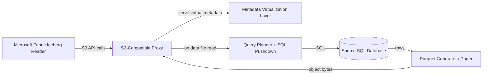

# Virtual Iceberg-over-S3 Proxy for Fabric (POC)

## 1. Requirement (as stated)

Build a proof-of-concept application that:

1. Emulates an S3 storage endpoint.
2. Exposes a virtual Apache Iceberg table layout so Microsoft Fabric believes table metadata and files exist in S3.
3. When Fabric attempts to read Iceberg table data files, the application does not read physical Parquet from S3.
4. Instead, it executes SQL pushdown queries against a source SQL database and streams/pages the resulting data back to Fabric as if it were the requested Iceberg data file.

## 2. Goal and Non-Goals

### Goal

Demonstrate read-path virtualization: Fabric reads a shortcut to an S3 Iceberg table, but actual data retrieval is served dynamically from SQL via an S3-compatible proxy.

### Non-Goals (for POC)

1. Full Iceberg write support.
2. Full S3 API compatibility.
3. Full Iceberg snapshot correctness under concurrent updates.
4. Production-grade security, durability, or scale guarantees.

## 3. High-Level Architecture

Architecture pattern:

1. Control plane behavior: serve Iceberg metadata objects (JSON/Avro) that define table schema, snapshots, manifests, and data file paths.
2. Data plane behavior: intercept GET for listed Parquet object paths and generate the file bytes on demand from SQL results.

## 4. Components Needed

## 4.1 S3-Compatible API Frontend

Purpose: mimic enough S3 semantics for Fabric to read Iceberg metadata and data files.

Minimum endpoints/behaviors:

1. GET object.
2. HEAD object.
3. ListObjectsV2 (prefix-based listing).
4. Bucket path routing.
5. Support for range requests if Fabric performs partial reads.

Notes:

1. Keep strict path and header handling predictable.
2. Return S3-like status codes and error payloads.

## 4.2 Iceberg Metadata Virtualization Layer

Purpose: present a valid Iceberg table structure without storing full physical table files.

Must provide virtual objects for:

1. metadata/<version>.metadata.json
2. metadata/snap-*.avro (manifest list)
3. metadata/*.avro (manifest files)
4. data/*.parquet entries referenced by manifests

Responsibilities:

1. Build/serve table schema and partition spec.
2. Maintain snapshot id and metadata location references.
3. Ensure file paths in manifests map to data file routes the proxy can serve.

## 4.3 SQL Pushdown Planner

Purpose: translate requested virtual data file reads into executable SQL.

Responsibilities:

1. Map requested file path -> logical split/filter.
2. Generate bounded SQL query with projection and predicates.
3. Enforce limits/chunking to keep response size bounded.
4. Optionally support predicate pushdown hints derived from manifest partition metadata.

## 4.4 Query Execution Layer

Purpose: execute generated SQL against source RDBMS safely.

Responsibilities:

1. Connection pooling.
2. Parameterized SQL only.
3. Query timeout and cancellation.
4. Retry policy (bounded).

## 4.5 Parquet Generation and Paging Layer

Purpose: convert SQL rows into object bytes that look like requested Parquet files.

Responsibilities:

1. Convert row batches to Parquet (schema-compatible with Iceberg metadata).
2. Stream or buffer object output.
3. Optional page token or deterministic chunking by split id.
4. Provide stable object length when possible (or chunked transfer if tolerated).

## 4.6 Metadata and Split State Store

Purpose: keep deterministic mapping between virtual Iceberg file references and SQL split definitions.

Store contains:

1. Table schema version.
2. Snapshot/version pointers.
3. Manifest to split mapping.
4. Virtual data file descriptors:
   - file path
   - projected columns
   - filter predicate
   - ordering/offset window

## 4.7 Cache Layer (Optional but Recommended)

Purpose: reduce repeated SQL and Parquet regeneration.

Caches:

1. Metadata object cache.
2. Generated Parquet object cache by virtual file key.
3. Query result cache for short TTL windows.

## 4.8 Observability and Diagnostics

Must include:

1. Request tracing (Fabric request id to SQL query id correlation).
2. Structured logs for each S3 object request.
3. Metrics:
   - metadata requests
   - data file requests
   - SQL latency
   - bytes served
   - cache hit ratio

## 4.9 Security Boundary

POC baseline:

1. Fixed credentials for S3-style access from Fabric connection.
2. Backend DB credentials isolated in service config.
3. Read-only SQL role.
4. Network ACLs between Fabric and proxy, and proxy and SQL.

## 5. Request Flow

## 5.1 Discovery and Metadata Flow

1. Fabric lists bucket/prefix.
2. Proxy returns metadata/ and data/ keys.
3. Fabric fetches latest metadata JSON.
4. Fabric fetches manifest list and manifest files.
5. Fabric determines data file paths to read.

## 5.2 Data Read Flow

1. Fabric GETs virtual data/<file>.parquet.
2. Proxy resolves file key to split definition.
3. Proxy compiles pushdown SQL.
4. Proxy executes SQL and obtains rows.
5. Proxy serializes rows to Parquet matching Iceberg schema.
6. Proxy returns bytes as object response.

## 6. Critical Design Constraints

1. Iceberg metadata must be internally consistent; broken references fail fast.
2. Declared file-level stats in manifests should match actual generated content enough for reader tolerance.
3. Schema drift in source SQL requires synchronized metadata regeneration.
4. If Fabric issues range reads, proxy must support byte-range semantics correctly.
5. Determinism is required: same virtual file key should map to stable results for a snapshot.

## 7. POC Assumptions

1. Read-only analytics scenario.
2. Single table first, no partition evolution initially.
3. Snapshot represented by a logical timestamp or source table watermark.
4. Eventual consistency acceptable for demo.

## 8. Risks and Failure Modes

1. Fabric reader may rely on stricter Iceberg manifest semantics than minimal emulation provides.
2. Mismatch between manifest metadata and generated Parquet can cause read failures.
3. Large scans can overwhelm proxy CPU/memory during on-demand Parquet generation.
4. Query latency can make object-read timeouts likely.
5. Concurrent reads can produce inconsistent slices without snapshot pinning.

## 9. Minimum Viable POC Scope

Implement first:

1. One virtual Iceberg table.
2. One fixed schema.
3. One snapshot at a time.
4. Limited virtual files (for example 8-32 logical splits).
5. Deterministic SQL split logic (hash/range).
6. GET/HEAD/ListObjectsV2 only.

## 10. Future Enhancements

1. Multi-table support.
2. Snapshot history and time travel emulation.
3. Better manifest statistics generation.
4. Async pre-generation of hot Parquet objects.
5. Materialized cache in object store for repeated reads.
6. Pluggable SQL dialect adapters.

## 11. Acceptance Criteria for This POC

1. Fabric can create and query a shortcut to the emulated S3 Iceberg table path.
2. Fabric successfully reads metadata and data through proxy endpoints.
3. At least one analytical query in Fabric returns rows sourced from SQL pushdown.
4. Logs prove end-to-end mapping:
   - Fabric object read
   - SQL query execution
   - Parquet object response
